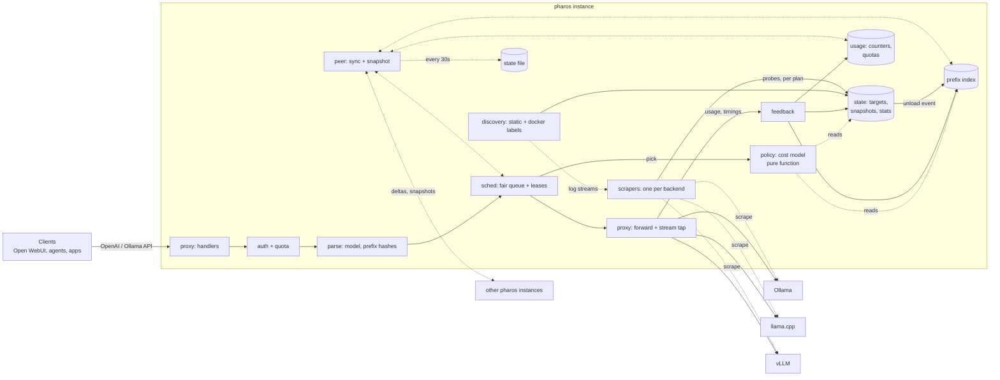
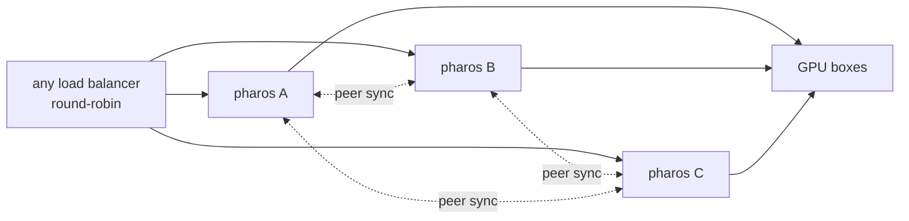

# Pharos architecture

Status: design, pre-implementation. Read [STRATEGY.md](STRATEGY.md) first. That doc says *what* Pharos does and *for whom*. This one says *how*.

Design goals, in priority order:

1. **Correct signals.** Engine behavior is verified by tests, never assumed from docs. Unknown is never 0.
2. **Simple.** One binary, in-memory state, no database, no consensus, few dependencies, few knobs.
3. **Testable.** Routing decisions are pure functions. Time and I/O are injected. Every engine adapter has fixture tests and live integration tests.
4. **Performance-aware.** The hot path does no disk I/O and no network calls except the upstream request itself. It holds no lock while doing I/O and has a measured overhead budget.
5. **Available.** Any instance can crash, restart or be replaced in a rolling update without losing keys, usage or learned routing state. Instances share state without coordinating (§12).
6. **Modular.** Adding an engine means adding a recipe of mostly existing library probes, plus fixtures. Adding an engine version means adding fixtures, and a newer probe for each signal that changed. Operators can add their own probes in config. Adding a policy means adding one function.

Non-goals for v1: autoscaling or clusters beyond a handful of instances, strong consistency between instances, Kubernetes operator, KV-event routing, prefill/decode disaggregation, translating between API formats (e.g. Ollama-native → vLLM), plugins.

---

## 1. Overview



There are three planes:

- **Data plane (hot path):** handle a request, pick a target, stream the response back, record feedback.
- **Control plane (background):** discover backends, scrape engine signals and follow engine logs, maintain state.
- **Peer plane (background):** exchange state with other instances and persist it to the state file.

The data plane and control plane share state only through the `state` package: atomic snapshot pointers plus counters owned by the scheduler. The peer plane only talks to the data plane through a non-blocking channel (outgoing) and the owning packages' `Merge` functions (incoming).

**A single instance is a cluster of one.** Replication is not a separate mode. A single instance has no peers, and it still restores from its state file through the same merge code that multi-instance setups use.



---

## 2. Core concepts

| Term | Meaning |
|---|---|
| **Backend** | One engine endpoint: a base URL, an engine kind (`ollama`, `llamacpp`, `vllm`, …), the engine version if it exposes one, and its current plan. |
| **Target** | A pair of **backend × model**. This is the unit we route to and schedule on. Single-model engines (vLLM, SGLang) have one target per backend. Ollama, llama.cpp in router mode, and llama-swap have one target per model. Locally a target has a small integer ID. Between instances it is named by its **target key** `backend URL + model`. |
| **Signal** | One piece of engine state Pharos routes on: residency, running, waiting, capacity, KV usage, … A fixed vocabulary (§4). |
| **Probe** | One way to read one signal from one feed (an HTTP path or the backend's log stream). The unit of engine adapter code (§4). When an engine version changes a metric, a newer probe replaces the old one for that version. |
| **Recipe** | The ordered list of probes an engine kind *may* offer. |
| **Plan** | The probes that actually answered on one backend, at its current version, plus the operator's own probes. Discovered at runtime, per backend (§4). |
| **Scrape** | One round of the plan's HTTP probes against a backend, run on a timer. |
| **Snapshot** | An immutable set of signals from one scrape round of a backend, merged from its plan's probes. Every field is an `Opt[T]`, meaning a value plus a *known* flag. `From` records the probe that filled each signal. |
| **Lease** | A slot on a target, held for the duration of one request. The scheduler grants it. The request releases it along with feedback. |
| **Generation** | A per-target counter, incremented when the model is unloaded or reloaded. It invalidates that target's prefix-index entries in O(1). Generations are local to an instance and never sent to peers. |
| **Origin** | A random 64-bit ID chosen at process start. It tags everything this process counts. A restarted process gets a new origin, so it never has to recover its previous counts. |
| **Peer** | Another Pharos instance sharing state with this one. |

```go
type Opt[T any] struct { V T; OK bool } // OK=false means unknown. Never read V without OK.
```

---

## 3. Package layout

The layout is flat, with one responsibility per package and dependencies flowing downward only.

```
cmd/pharos/          main: flag parsing, wiring, subcommands (serve, doctor, keys)
internal/config/     YAML config + env overrides → typed Config; hot reload of keys and static backends
internal/engine/     Snapshot and Signal types, probe library, per-kind recipes, plan resolution, auto-detect, Prometheus text parser
internal/discovery/  static list + Docker label watcher → desired []BackendSpec, each with its log-stream opener
internal/state/      target registry, snapshot storage, EWMA stats, scrape and log-follow loops, generations
internal/prefix/     chained message hashing + bounded LRU index
internal/policy/     cost model: Pick(RouteReq, []Candidate) Decision. Pure, no I/O, no clock
internal/usage/      per-origin counters: usage history, RPM windows, daily token quotas
internal/sched/      admission, per-key fair queue, leases, inflight accounting
internal/proxy/      HTTP handlers, request parse, upstream forward, stream tap, feedback, drain
internal/peer/       peer membership, delta push, snapshot pull/merge, state file
internal/obs/        /metrics, /status page, /usage, decision logging
```

Dependency direction: `cmd → peer, proxy`; `peer → sched, usage, prefix, state`; `proxy → sched → policy, prefix, usage, state → engine`; and `discovery → state`.

- `policy` imports nothing from Pharos except its own input types. That keeps it trivially table-testable.
- Each replicated package (`prefix`, `usage`, `sched`, `state`) owns its own `Export`/`Merge` functions. `peer` only moves bytes and schedules merges; it has no merge logic of its own.
- There is no shared `types` package. Each type lives in the package that owns it.

**Dependencies (target: ≤ 3 outside the standard library):**

- `gopkg.in/yaml.v3`: config.
- `github.com/prometheus/client_golang`: exposing our own metrics, histograms in particular.

Deliberately *not* used:

- **A database (SQLite, Postgres).** Keys live in the config file. Usage is a set of small mergeable counters kept in memory, replicated to peers and saved to the state file (§11, §12). A database would only be a local copy of the same data.
- **Raft or other consensus (rqlite, dqlite, hashicorp/raft).** It needs 3 nodes for a quorum, puts a round-trip on every write, and adds failure modes (split brain, quorum loss) that a small team can't operate. None of our state needs agreement between instances (§12).
- **Docker SDK.** We call the Engine API directly over the unix socket with `net/http`.
- **Prometheus `expfmt` for parsing.** We need a few gauges and counters, so a small line parser with fixture tests is enough.
- **Web frameworks.** `net/http` `ServeMux` patterns are enough.
- **testcontainers.** CI starts the engines with docker compose.

Standard library used: `net/http`, `net/http/httputil`, `log/slog`, `hash/maphash`, `container/list`, `html/template`, `sync/atomic`, `encoding/gob`, `crypto/sha256`, `crypto/subtle`.

---

## 4. Engine adapters (`internal/engine`)

Engines differ in **how their state is read** and in **which usage fields their responses carry**. State is read by probes (this section). Response usage is read by the stream tap (§9) with the same rule, so it needs no per-engine code either, and it is fixture-tested per engine version in the same way.

**Engine behavior depends on the engine version, and it drifts one signal at a time.** A release renames one metric, adds one endpoint, or changes what one field means, and everything else stays the same. So the unit of adapter code is a **probe**: one way to read **one signal** from one feed. An engine adapter is not code. It is a combination of probes: the engine kind's recipe, plus any probes the operator adds in config. When a version changes one metric, a newer probe for that signal goes ahead of the old one and nothing else changes. The engine's name and version are metadata, not dispatch keys.

```go
type Signal uint8 // the fixed vocabulary; each one maps to one Snapshot field
const (
    Version Signal = iota    // per backend
    Models                   // which models the backend serves
    Residency                // per model: Loaded | Loading | Cold
    VRAMBytes, SizeBytes     // per model
    Running, Waiting, Capacity // per model, or "" = whole backend
    KVUsage                  // 0..1
)

type Probe struct {
    Name   string                        // "vllm-kv-cache-usage-perc"; shown by doctor and /status
    Signal Signal                        // the one signal it reads
    Feed   Feed                          // where its input comes from
    Parse  func(in []byte) (Snapshot, error) // in = a whole HTTP body, or one log line. Only Signal is read from the result
    When   func(version string) bool     // nil = any version. Only for semantic drift, see below
}

type Feed struct {
    Path string // HTTP GET, run each scrape round; probes on the same path share one GET
    Log  bool   // or: one line at a time from the backend's log stream (see Log probes)
}

type Plan struct {
    Kind    Kind
    Version Opt[string]
    Active  []Probe                      // own probes first, then recipe order
    Dropped map[string]string            // probe name -> why (404, parse error, no value, redundant, version guard, no log feed)
}

func Resolve(ctx context.Context, c *http.Client, base string, k Kind, own []Probe) (Plan, Snapshot, error) // runs the whole recipe
func (p Plan) Scrape(ctx context.Context, c *http.Client, base string) (Snapshot, error)                 // runs the active HTTP probes
func (p Plan) Follow(ctx context.Context, logs io.Reader, emit func(Snapshot)) error                     // runs the active log probes on each line

var Recipes = map[Kind][]Probe{ // probes we trust per kind; order = priority when two probes read the same signal
    VLLM: {
        vllmVersion, openaiModels,
        Prom("vllm-running", "/metrics", Running, "vllm:num_requests_running", PerModel("model_name")),
        Prom("vllm-waiting", "/metrics", Waiting, "vllm:num_requests_waiting", PerModel("model_name")),
        Prom("vllm-kv-cache-usage-perc", "/metrics", KVUsage, "vllm:kv_cache_usage_perc", PerModel("model_name")),
    },
    LlamaCpp: {
        llamacppProps,  // Capacity (total_slots)
        llamacppModels, // Models and Residency in router mode
        Prom("llamacpp-running", "/metrics", Running, "llamacpp:requests_processing"),
        Prom("llamacpp-waiting", "/metrics", Waiting, "llamacpp:requests_deferred"),
        llamacppSlotsRunning, // /slots: the fallback when --metrics is off
    },
    Ollama: {ollamaVersion, ollamaPSResidency, ollamaPSVRAM, ollamaTagsSize},
    // SGLang, TRT-LLM, LM Studio, llama-swap and OpenAI (generic, also mlx-lm: model list only) follow
    // the same pattern. STRATEGY §4 lists the signals each one is expected to offer.
}

type Snapshot struct {
    At      time.Time
    Version Opt[string]             // engine version, if exposed
    Models  map[string]ModelInfo    // model -> residency
    Load    map[string]Load         // model -> occupancy; key "" = whole backend
    From    map[Signal]string       // signal -> probe that filled it (doctor, /status)
}
type ModelInfo struct {
    State     Residency             // Loaded | Loading | Cold | Unknown
    VRAMBytes Opt[int64]
    SizeBytes Opt[int64]            // needed to decide whether a cold load fits
}
type Load struct {
    Running, Waiting, Capacity Opt[int]
    KVUsage                    Opt[float64] // 0..1
}
```

The metric names and labels in the recipes above are unverified [U] until a live test has seen them.

**Why recipes are still keyed by kind** when the plan already discovers which probes answer: running every probe against every backend would be simpler, but it isn't safe. Engines emulate each other's APIs for client compatibility (Ollama-style endpoints in particular [U: which engines, and how faithfully]). An emulated endpoint can return well-formed placeholder values, and a well-formed wrong value is exactly the failure Pharos exists to prevent. The recipe is therefore the list of probes we *trust* on that engine, in priority order. The kind also decides target cardinality and which native API routes the backend accepts (§9). The kind says what we trust; the plan says what answers.

`// ponytail: one kind per backend; a proxy that fronts another engine (e.g. llama-swap in front of llama.cpp) may need probes from both, add a composed recipe when a real setup needs it`

**The probe library** (`engine.Library`, every built-in probe that recipes draw from). Most probes are built from a few generic constructors, so behavior that several engines share is written once:

- `Prom(name, path, signal, metric, opts...)`: one metric from a Prometheus-text endpoint. Options name the label that splits it per model and the scale (percent vs 0..1). vLLM, SGLang, llama.cpp and TRT-LLM differ only in the metric names they pass.
- `LogLine(name, signal, pattern)`: one regular expression with named groups `model` and `value`, or a fixed value for the signal when the line matches.
- `openaiModels`: `/v1/models`, which every tier speaks.
- Engine-specific JSON probes exist only where an engine has a JSON endpoint of its own: `ollamaPSResidency`, `llamacppSlotsRunning`, `llamacppProps`, `sglangLoads`, `lmstudioModels`, `llamaswapRunning`, and so on.

**A probe enters the library only after its metric, field or log line has been seen in a real capture** (ours or user-submitted), never from docs.

**Own probes.** Operators can add probes per backend in config (§10), using the same `Prom` and `LogLine` constructors. An own probe goes ahead of the recipe for its signal. This lets a team fix a renamed metric, or read an engine that has no recipe, without waiting for a Pharos release. Own probes are not in the fixture suite, and `doctor` and `/status` label them as own.

`// ponytail: own probes cover Prometheus metrics and log lines only; add a JSON-path kind when a user needs a JSON endpoint the library lacks`

**Merge.** A scrape round runs the HTTP probes of the backend's plan, with one GET per path. For each signal, the first probe in plan order that returns a known value wins, and `From` records which probe that was. A signal that no probe knows stays unknown. Probes never make up defaults.

**The plan: discovered per signal, not per version.** `Resolve` runs every probe in the recipe, plus the backend's own probes. A probe is dropped if its path returns 404, it fails to parse, it yields no known value, or a higher-priority probe already reads its signal (redundant). The rest become that backend's **plan**, and later scrape rounds call only the plan's probes. Dropping redundant probes keeps scrape load within budget (§15). A fallback probe comes back through re-resolution if the preferred one fails. The plan is resolved again when `Version` changes, when a planned probe starts failing, and every 10 minutes. An engine upgrade that renames a metric or removes an endpoint therefore only changes which probes resolve. No per-version code runs.

`pharos doctor` prints the result of `Resolve` for each configured backend: kind, version, active and dropped probes (with the reason), and which signals are unknown. `doctor --record <dir>` saves the raw bodies in the layer-2 fixture format (§14).

**Log probes.** A log line is just another feed. A log probe has the same shape as an HTTP probe, and its `Parse` gets one line instead of a body:

- **The feed.** v1 reads logs through the Docker Engine API over the socket that discovery already uses (`GET /containers/{id}/logs?follow=1&stdout=1&stderr=1&since=<now>`; the stream is multiplexed into frames unless the container has a TTY [U]). A backend found through Docker labels gets its feed automatically. A static backend gets one with `logs: docker://<container>` (§10). A backend with no feed drops its log probes with the reason "no log feed".
- **In the plan.** A log probe can't return a 404. It stays active while the backend has a feed, unless a higher-priority probe already reads its signal. `doctor` shows it as "no match yet" until a line matches.
- **Values.** The feed starts at "now", so a log probe knows nothing until a matching line appears. A log-derived value holds until a newer matching line replaces it, and it becomes unknown when the stream disconnects. Recipes put scraped probes first, so log probes fill signals and events that no endpoint shows. They don't replace scraped state.
- **Privacy.** Lines are matched in memory and dropped. Only the captured values (a model name, a number) are kept. Log lines are never logged, stored or sent to peers. `doctor --record` captures log lines only with `--logs`, and warns that engine logs can contain prompts.
- **What ships.** No built-in log probe ships until a live test has seen its line. Which engine lines carry useful signals, for example Ollama model loads and unloads, is [U].

`// ponytail: Docker is the only log feed; add file tailing when someone runs engines outside Docker and needs log probes`

**Version guards are the exception.** They cover one case only: **the same name means different things in different versions**, where nothing in the payload tells the two apart (for example, a gauge that switches from percent to 0..1 without being renamed). Then the old and new meanings are two probes with complementary `When` ranges, and fixtures from both sides of the change prove them. If the version is unknown, neither guarded probe runs, so the signal stays unknown instead of possibly wrong. Every other kind of drift is handled without guards:

| Drift | Handled by |
|---|---|
| metric or field renamed | a newer probe for the new name, ahead of the old one in the recipe; the plan keeps whichever answers |
| endpoint added or removed | the plan: the probe resolves or doesn't |
| endpoint renamed | a newer probe on the new path, ahead of the old one |
| same name, new meaning | two probes with complementary `When` guards + fixtures on both sides |
| drift not yet in a release | an own probe in config |
| new engine | a recipe, mostly built from library constructors |

Rules for every probe:

- **A missing field, metric or log line means `OK=false`.** Never substitute a default. A metric that is present but unparseable is an error, and it is surfaced.
- **Probes don't touch shared state.** They return a value. `state` decides what to do with it.
- **Each library probe is proven by fixtures.** Its replay test runs against every recorded capture that contains its feed (§14).
- **A replaced probe stays in the recipe** for as long as we support an engine version that needs it.
- **Support matrix:** one row per engine version, one column per signal. A cell holds the probe that supplies that signal on that version (verified live, or by fixture only), or *unknown*.
- **`Kind: auto` detection** checks fingerprint endpoints in a fixed order (`/api/version` → Ollama, `/props` → llama.cpp, `/running` → llama-swap, `/server_info` → SGLang, `/version` plus vLLM metrics → vLLM) and falls back to the generic `OpenAI` recipe. This is what makes zero-config Docker labels possible. The fingerprint paths are doc-derived [U] and drift like anything else, so they get the same fixture tests as probes. The kind picks the recipe and the target cardinality (one target per backend or per model). The plan picks the probes.

**Adding an engine** means adding a recipe from library constructors, a new JSON probe only where no constructor fits, `engine/testdata/<name>/<version>/<state>/` fixtures, a live integration test, and a row in the support matrix. **Adding an engine version** means recording a new fixture directory. Code changes only if a replay test fails, and then usually just one newer probe for the signal that changed.

---

## 5. State (`internal/state`)

```go
type Target struct {
    ID      uint16                      // small int: keeps prefix-index entries compact
    Key     string                      // backend URL + model: the name peers use
    Backend *Backend
    Model   string
    snap    atomic.Pointer[TargetView]  // latest derived view, swapped by the scraper
    gen     atomic.Uint32               // bumped on unload/reload
    stats   Stats                       // EWMAs, see below
}
```

- **One scraper goroutine per backend.** It calls `engine.Resolve` once, then `Plan.Scrape` on a ticker with jitter. A probe runs every 1 s if its signal is `Running`, `Waiting` or `KVUsage`, and every 5 s otherwise (residency, capacity, version). Probes on the same path share one GET at the shorter interval. Both intervals are configurable. The scraper re-resolves the plan on the triggers in §4. Each round derives a `TargetView` per target and publishes it with an atomic pointer swap. Readers never block.
- **Log follower.** If the plan has active log probes, a second goroutine opens the backend's log stream (from its `BackendSpec`) and runs `Plan.Follow`. It hands each value to the scraper goroutine, which stays the only writer of the published view. When the stream drops, its values become unknown and the follower reconnects with backoff.
- **Every instance scrapes independently.** Scrape results are not replicated, because each instance needs fresh signals of its own and a peer's view would be older. N instances mean N× scrape load, which stays within budget (§15) for a handful of instances.
- **Staleness.** A scraped signal older than 3 × its interval is treated as unknown by the policy. A log-derived signal is unknown while its stream is disconnected (§4).
- **Residency transitions** (Loaded→Cold, or a changed `expires_at`/digest that means a reload) bump the target's `gen`. That lazily invalidates its prefix entries.
- **Stats** are exponentially weighted moving averages (EWMAs), updated from request feedback and not from scrapes:
  - `prefillSecPerTok`: (TTFT − queue wait) / uncached prompt tokens.
  - `loadSec`: Ollama's `load_duration` where available, otherwise TTFT outliers on cold dispatches.
  - `serviceSec`: mean request duration, used to estimate queue wait.

  An EWMA with no samples is unknown, and the policy falls back to the fleet median, then to a config default. Stats are not synced continuously: behind a round-robin load balancer, every instance sees a similar sample of traffic. They are included in snapshots, so a new instance starts with its peers' estimates instead of none. A restored value is only used for a target that has no local samples yet.
- **Discovery** hands state a desired `[]BackendSpec`. State diffs it against the current set: new backends start scrapers, removed ones drain (no new leases; in-flight requests finish).

---

## 6. Prefix index (`internal/prefix`)

This is a chained hash per message, not a character radix tree. It's less code, bounded memory, and never stores prompt text.

```
h0 = maphash(seed, model, tools)          // tools/system preamble render first in most templates
hi = maphash(h(i-1), role_i, content_i)   // content hashed as raw JSON bytes, as sent
```

- **The seed is fixed and shared** (derived from the peer secret, or a constant when there are no peers), so hashes agree across instances and survive restarts.
- For `/v1/completions` and Ollama `/api/generate`, the prompt string is split into fixed 1 KiB blocks and chained the same way.
- **Entry:** `map[uint64]*list.Element`, plus LRU order. Each entry holds up to 4 `(targetID, gen, lastUsed)` slots, about 100 B per entry. The default cap is 200k entries, roughly 20 MB.
- **Lookup:** walk `h_n … h_0`, longest first. Return, per target, the matched byte length, skipping slots whose `gen` is stale. The router converts matched bytes to estimated tokens at about 4 bytes per token. This is a known approximation; the cost model only needs relative values.
- **Record:** after dispatch, add the target to every `h_i` of the request.
- **Correct:** if the response reports cached tokens far below the prediction, remove that target from the request's entries. This is how the index learns each engine's real retention without us modelling slots, block sizes or eviction.
- **Concurrency:** a single mutex. Lookup and record are O(messages) with no I/O.

  `// ponytail: one mutex; shard by hash if lock contention shows in benchmarks`

- **Known miss:** clients that re-encode JSON differently (key order, escaping) won't match each other. This is acceptable because the same client is consistent with itself.

**Replication.** The index is a *hint*: a wrong entry costs one cache miss, and correction then removes it. That makes it safe to replicate lossily, with no ordering guarantees:

- Every record and correction is also pushed, without blocking, onto the peer channel as a `PrefixOp{TargetKey, Hashes, LastUsed, Remove}`. If the channel is full, the op is dropped.
- `Merge(ops)` applies peer ops as local records and removals. It maps target keys to local IDs; ops for unknown targets are dropped. Merged slots are stamped with the receiver's *current* `gen` for that target. If a peer recorded an entry just before an unload that the receiver has already seen, the entry looks fresh by mistake; that costs one miss and correction removes it.
- `Export()` returns all live entries, most recently used first, for snapshots (§12).

---

## 7. Routing policy (`internal/policy`)

STRATEGY §3 lists the policy as ordered steps: residency, then workload, then prefix. Pharos implements them as **one cost: estimated time to first token (TTFT) in seconds.** The ordering emerges from the numbers rather than from hand-tuned thresholds.

```go
func Pick(r RouteReq, cands []Candidate, cfg Config) Decision

type Candidate struct {
    TargetID       uint16
    Warm           Opt[bool]
    Capacity       int          // slots per target: engine-reported, config, or the §8 fallback
    FreeSlots      int          // capacity - occupied (see §8)
    QueueAhead     int          // router waiters (all instances) + engine-reported waiting
    KVUsage        Opt[float64]
    MatchedTokens  int          // from prefix index
    PromptTokens   int          // estimated
    PrefillSecTok, LoadSec, ServiceSec Opt[float64]
    FitsIfCold     Opt[bool]    // memory headroom check
}

type Decision struct {
    TargetID uint16
    Enqueue  bool            // all worth-it targets busy: wait in fair queue
    Reason   string          // "warm, 1.2k cached tok, est 0.4s vs 3.1s (cold)" → logs + status page
    Scores   []Score         // per candidate, for debugging and tests
}
```

**Cost per candidate:**

```
est_ttft = wait + load + prefill
  wait    = 0 if FreeSlots > 0 else (QueueAhead+1) / Capacity × ServiceSec
  load    = 0 if Warm else LoadSec                 (infeasible if !FitsIfCold)
  prefill = (PromptTokens − MatchedTokens) × PrefillSecTok
  + KV pressure penalty when KVUsage > 0.9 (the cache is likely to be evicted, so trust the match less)
```

- Pick the lowest `est_ttft`. Break ties on lower utilization, then randomly, so identical requests don't herd onto one target.
- If the best target has no free slot, return `Enqueue`.
- Unknown estimates fall back to the fleet median, then to config defaults. A missing signal never becomes 0.

**Why a cost model rather than SMG-style thresholds:** it gives one comparable unit across heterogeneous hardware. Cache affinity turns into "prefill time saved", reload thrash into "load time paid", and imbalance into "wait". Prefix herding corrects itself, because piling onto the cached target raises its `wait`. It also yields a human-readable reason for every decision.

**`least-load` policy:** the same signature, scoring on utilization only. This is the escape hatch if the estimates misbehave on some fleet.

**Cold loads and memory:**

- `FitsIfCold` is true if the model's size is at most the configured host memory minus the VRAM already loaded. Loaded models with zero in-flight requests count as evictable.
- We never pick a cold load that would evict a model with in-flight requests.
- `// ponytail: coarse memory model (sizes from /api/tags), refine with real VRAM math if users hit OOM/evictions`

---

## 8. Scheduler (`internal/sched`)

The scheduler owns admission, inflight counts, and the fair queue. Within one instance, picking a target and acquiring a slot on it happen as one atomic step.

```go
func (s *Sched) Acquire(ctx context.Context, key *Key, r RouteReq) (*Lease, error)
func (l *Lease) Release(fb Feedback)
```

- **One mutex around pick + acquire.** `Acquire` builds candidates (from state snapshots, inflight counts and prefix lookups), calls `policy.Pick`, and either takes a slot or enqueues. Pick is microseconds and does no I/O, so serializing it is fine at small-team scale. Within an instance, this removes the whole class of races where two requests both see a slot as free.

  `// ponytail: global sched lock; per-model locks if routing throughput ever matters (>~5k rps)`
- **Occupancy counts everyone, not just us:**

  ```
  occupied = max(local_inflight + Σ live peers' inflight,  engine Running if known and fresh)
  ```

  The engine term covers clients that bypass Pharos, and peers that are partitioned from us. The peer term covers the 1–2 s the engine's metrics lag behind. Peer inflight arrives every sync tick (§12). Two instances may grant the last slot within the same tick, which overcommits a target by at most N−1 requests. The engine queues the excess briefly. This is the price of not coordinating, and it's the same thing any engine does under load.
- **Fair queue.** Waiters are kept in per-key FIFOs and served round-robin across keys, with an optional per-key weight (deficit round-robin). When a slot is released, locally or by a peer (seen as its inflight dropping), the next waiter is re-run through `policy.Pick` with the freed slot now counted. A waiter can therefore land on a different target than the one it waited for, if that target is now better. Each instance keeps its own queue. Behind a round-robin load balancer each instance sees a share of every key's traffic, so fairness holds approximately across the cluster.
- **Capacity per target** is taken from the engine where reported (llama.cpp `total_slots`, SGLang `max_running_requests`), otherwise from config (for example Ollama's `OLLAMA_NUM_PARALLEL`). If neither is known, the target counts as saturated when the engine reports `Waiting > 0` or after 2 in-flight requests. That default is conservative and can be overridden.
- **Cancellation.** If the client disconnects, the context is cancelled: the waiter leaves the queue, or the upstream request is aborted (the engine stops generating) and the lease is released.
- **Quotas** are checked at admission through `usage` (§11): requests per minute and tokens per day, both summed across all instances.
- **Gauges for peers.** `Export()` returns this instance's inflight per target and waiters per model. `Merge(origin, gauges)` replaces that origin's last report.

---

## 9. Proxy (`internal/proxy`)

**Routes:**

| Path | Backends |
|---|---|
| `/v1/chat/completions`, `/v1/completions`, `/v1/embeddings` | any engine (all tiers speak OpenAI-compatible) |
| `/v1/models` | aggregated model list |
| `/api/chat`, `/api/generate`, `/api/embed` | Ollama backends only (v1: no API translation) |
| `/api/tags`, `/api/ps` | aggregated across Ollama backends (Olla returns 501 for `/api/ps`) |
| `/metrics`, `/healthz` | Pharos itself |
| `/status`, `/usage` | Pharos itself, admin key required |

Peer endpoints are served on a separate listener (§12), never on the public one.

**Request path:**

1. **Auth.** Look up the bearer key's SHA-256 in an in-memory map built from the config file (§10). The map is swapped atomically on config reload. There is no I/O per request.
2. **Parse.** Read the body once, bounded (default 32 MiB, for base64 images), into a pooled buffer. Decode only `model`, `messages[].role` and `messages[].content` (as `json.RawMessage`), `tools`, `prompt` and `stream`. Compute the prefix hash chain and estimate prompt tokens.
3. **Acquire** a lease (§8).
4. **Forward** with `httputil.ReverseProxy`:
   - `FlushInterval: -1`, so SSE and Ollama NDJSON stream token by token;
   - a shared `http.Transport` with keep-alive and `MaxIdleConnsPerHost` sized to capacity;
   - a response-header timeout chosen per decision: long for cold loads (models can take 60 s or more to load), short for warm targets;
   - no overall body timeout, because streams can be long.
5. **Retry** once, on another target, only if nothing has been written to the client yet (connection refused, or a 503 from the engine). After the first byte there are no retries. Repeated failures eject a target with backoff.
6. **Tap.** Wrap the upstream body in a line scanner that passes bytes straight through and remembers only the last usage-bearing JSON line (line length is bounded; longer lines pass through unparsed). It extracts the union of known fields. The field list is data and follows the probe rule (§4): each usage value has an ordered list of fields, a newer field name goes ahead of the old one only after a recorded stream shows it, and recorded response streams per engine version prove it (§14):
   - OpenAI: `usage.prompt_tokens`, `usage.prompt_tokens_details.cached_tokens`
   - llama.cpp: `timings.cache_n`, `timings.prompt_n`
   - Ollama: `prompt_eval_count`, `eval_count`, `load_duration`, `prompt_eval_duration`
7. **Feedback.** Release the lease along with TTFT (time to first body byte), duration, usage and cached tokens. That updates stats, corrects the prefix index, and adds to this origin's usage counters.

**We don't inject `stream_options.include_usage`,** because it changes the response the client sees. Feedback is best-effort: if a response has no usage, the stats simply don't update.

**Model names.** v1 routes exact names only. An optional alias map (e.g. `llama-8b` → `ollama:llama3.1:8b`, `vllm:meta-llama/Llama-3.1-8B-Instruct`) rewrites `model` when forwarding.
`// ponytail: alias rewrite re-encodes the body; do a targeted byte rewrite if it shows in profiles`

**Readiness and drain.** Together these make restarts and rolling updates invisible to clients:

- `/healthz` returns 503 until state is restored (§12) and the first scrape round has finished, so a new instance never routes blind.
- On SIGTERM: `/healthz` turns 503; the instance keeps accepting requests for `drain.grace` (default 5 s) so the load balancer notices; it then stops accepting and waits for in-flight streams up to `drain.timeout` (default 10 min, longer than the longest generation); finally it sends a last delta marked `Leaving`, writes the state file and exits.

---

## 10. Config and discovery (`internal/config`, `internal/discovery`)

```yaml
listen: :8080
policy: cost              # or least-load
backends:
  - url: http://gpu-box:11434
    kind: auto            # or any recipe: ollama | llamacpp | vllm | sglang | trtllm | lmstudio | llamaswap | openai
    memory_gb: 24         # Ollama doesn't report total VRAM
    capacity: 4           # per target, if the engine doesn't report it
  - url: http://gpu-box:8000
    kind: vllm
    logs: docker://vllm-1 # optional log feed for log probes; Docker-label backends get one automatically
    probes:               # optional own probes (§4); each goes ahead of the recipe for its signal
      - name: my-vllm-running
        signal: running
        prom: {path: /metrics, metric: vllm:num_requests_running, per_model: model_name}
      - name: my-model-loaded
        signal: residency
        log: {match: 'model (?P<model>\S+) loaded', value: loaded}
keys:
  - name: alice           # unique; usage is recorded by name
    sha256: 9f86d081…     # printed by `pharos keys new --name alice`
    rpm: 60
    tokens_per_day: 2000000
    weight: 1             # fair-queue share
    models: []            # optional allow-list
  - name: ops
    sha256: 2c26b46b…
    admin: true           # may read /status and /usage
state_file: /data/pharos.state   # optional; recommended for single-instance setups
usage:
  timezone: UTC           # day boundary for tokens_per_day and daily usage
  retention_days: 400
peers:                    # optional; omit for a single instance (§12)
  listen: :8081
  secret_file: /run/secrets/pharos-peer
  members: [pharos-a:8081, pharos-b:8081, pharos-c:8081]   # may include self
  # dns: pharos-peers.default.svc.cluster.local           # k8s headless Service, instead of members
```

- **Keys live in config.** `pharos keys new --name alice` prints the key once, together with the YAML entry that holds its SHA-256. The key itself is never stored. Every instance reads the same file (a mounted volume, a k8s Secret or ConfigMap, or GitOps). There is no key database to replicate and no admin HTTP API.
- **Hot reload.** The config file is re-read when its modification time changes (checked every 10 s). Keys, quotas and static backends (including their own probes, which trigger a re-resolve) apply live. Other fields are logged as "restart required".
- **Own probes are shared with YAML anchors** when several backends need the same one. There is no separate probe registry.

**Docker labels.** Pharos watches `/var/run/docker.sock`, mounted read-only, through the Engine API events stream and adds any container that carries the labels, with the container's log stream as its log feed (§4). It combines them with the static list. Zero-config is `pharos.enable=true` plus `kind: auto`.

```yaml
services:
  ollama:
    image: ollama/ollama
    labels:
      pharos.enable: "true"
      pharos.port: "11434"
      pharos.memory_gb: "24"
```

**Multiple instances need the same backends and keys.** Docker label discovery only sees the local Docker host, so it suits a single instance, or instances on the same host. Multi-host setups should use the static list. Peers exchange a fingerprint of their backend set and key set. A mismatch shows on `/status` and as a metric, instead of silently routing differently.
`// ponytail: docker discovery is per-host; share discovered backends over peer sync if multi-host Docker users ask`

---

## 11. Usage and quotas (`internal/usage`)

Usage history and quota counting use one mechanism: **per-origin counter cells**.

```go
type Cell struct {
    Origin  uint64   // the process that counted it
    Kind    uint8    // Day | Minute
    Bucket  int64    // day number in usage.timezone, or unix minute
    Key     string   // key name
    Model   string   // "" for Minute cells
    Requests, PromptTok, CachedTok, CompletionTok uint64
}
```

- **A process only ever increments its own origin's cells.** Cells from other origins are read-only copies.
- **Merge** keeps the field-wise max per `(Origin, Kind, Bucket, Key, Model)`. That makes it commutative and idempotent: deltas may arrive late, twice or out of order, and the result is the same.
- **Totals** are a sum over origins. Cells of departed origins (a crashed or replaced instance) stay, so their usage is never lost as long as any instance or state file holds them.
- **Tokens per day** for a key = the sum of today's `Day` cells for that key (prompt + completion tokens).
- **Requests per minute** uses a sliding-window estimate over `Minute` cells: `prev_minute × (1 − elapsed fraction) + current_minute`. `Minute` cells older than 2 minutes are dropped and never persisted.
- **Across instances, quotas are approximate.** A key can overshoot by up to one sync tick of traffic (§12). That is fine for fairness quotas; Pharos does not do billing.
- **History** is `Day` cells kept for `usage.retention_days`. Size: 20 keys × 10 models × 400 days is 80k cells per origin that was active on those days, a few MB. `/usage?from=&to=&by=key|model` returns JSON or CSV; `/status` shows today and the last 30 days.
- **Prometheus users** also get `pharos_tokens_total{key,model,type}` from `/metrics`. Prometheus's `sum(increase(...))` handles restarts and multiple instances natively.

**Durability.** With peers, a crash loses at most one sync tick of that instance's usage (§12). Without peers, it loses at most one state-file interval (30 s). A graceful shutdown loses nothing. Requests still streaming when a process crashes produce no feedback, so they are never counted.

---

## 12. Peers and availability (`internal/peer`)

Pharos gets high availability without consensus. **Every piece of shared state has a merge rule that needs no agreement between instances:**

| State | Owner | Merge rule | If sync fails |
|---|---|---|---|
| Prefix index | `prefix` | Apply ops as local records/removals; bounded LRU | Worse cache affinity; correction repairs wrong entries |
| Inflight per target, waiters per model | `sched` | Per origin: latest report replaces the previous one; dropped after 2 s of silence | Occupancy falls back to local count + engine `Running` |
| Usage and quota cells | `usage` | Per cell: field-wise max; totals sum over origins | Quotas are briefly loose; history catches up on reconnect |
| Stats (EWMAs) | `state` | Snapshot only; used for targets with no local samples | New instance learns from its own traffic |

When sync fails, **each instance behaves exactly like a standalone instance.** A partition therefore lowers routing quality but can't corrupt state or stop serving.

**Protocol.** Full mesh, push-based, over HTTP on `peers.listen`:

```go
type Delta struct {          // POST /peer/delta, every tick (200 ms)
    Proto       uint16       // wire version; a peer on an incompatible version is ignored and flagged
    Origin      uint64
    Fingerprint uint64       // hash of backend set + key set (§10)
    Leaving     bool         // sent on shutdown: drop my gauges now
    Gauges      sched.Gauges // this origin's full current inflight/waiters
    Cells       []usage.Cell // this origin's cells: today + yesterday, current + previous minute
    Prefix      []prefix.Op  // records and corrections since the last tick (lossy)
}

type Snapshot struct {       // GET /peer/snapshot
    Proto  uint16
    Prefix []prefix.Entry    // by target key, most recent first
    Cells  []usage.Cell      // Day cells of all origins, within retention
    Stats  []state.TargetStats
}
```

- **Encoding:** `encoding/gob`. It ignores unknown fields, so mixed versions during a rolling update interoperate; `Proto` is bumped only for breaking changes.
- **Auth:** a shared secret sent as a bearer token and compared with `crypto/subtle`. Pharos refuses to start peers without one. The peer listener belongs on a private network. `// ponytail: plain HTTP between peers; add peers.tls cert/key when someone runs peers across an untrusted network`
- **Membership:** from `peers.members`, or by re-resolving `peers.dns` every 10 s. A member whose `Origin` equals our own is ourselves and is skipped. `// ponytail: full mesh; fine for ≤ ~5 instances, switch to gossip if someone runs more`
- **Deltas carry absolute values** of this origin's counters, not increments. A lost delta is repaired by the next one, so there is nothing to acknowledge or retry. Only prefix ops are lossy, and those are hints.
- **The hot path never waits on peers.** Feedback pushes prefix ops onto a bounded channel without blocking, and drops them when it's full. One sender goroutine per peer builds a delta each tick. Received deltas are merged by the owning packages under their existing locks.

**One restore mechanism for three cases.** Merging is idempotent, so restoring from several sources is always safe:

1. **Startup:** merge the state file if one exists, then merge a snapshot from every reachable peer (with a 5 s timeout overall). Only after that does `/healthz` start reporting ready.
2. **Reconnect:** when a peer that was unreachable answers again, pull its snapshot and merge it. This heals anything missed during a partition, including cells of instances that died meanwhile.
3. **Warm restart without peers:** the state file is the `Snapshot` format, written every 30 s and on shutdown (write to a temp file, then rename). This is how a single docker-compose instance keeps its prefix index and usage across upgrades.

**Deploying with peers:**

- 2–3 instances behind any round-robin load balancer. Because prefix and occupancy are shared, no stickiness is needed.
- Kubernetes: a Deployment with `maxUnavailable: 0, maxSurge: 1`, so a live peer is always there to bootstrap from; a headless Service for `peers.dns`; and `terminationGracePeriodSeconds` greater than `drain.grace + drain.timeout`. No PersistentVolume is needed, because peers hold the state. Losing every instance at once loses the state unless a `state_file` is on a volume.
- docker-compose on 2–3 hosts: a static `peers.members` list plus keepalived or DNS in front.

---

## 13. Observability (`internal/obs`)

- **`/metrics`:**
  - per target: inflight (local and cluster-wide), queue depth, residency, and signal freshness, including how many signals are *unknown*;
  - per backend: engine version, active probes, log stream up/down, and plan changes (a plan change after an upgrade is how engine drift shows up in production);
  - decisions by reason;
  - prefix prediction accuracy (predicted vs reported cached tokens), split by whether the entry came from a local record or a peer;
  - histograms of TTFT and of Pharos's own overhead;
  - usage counters per key and model;
  - peers: up/down, delta lag, dropped prefix ops, fingerprint or protocol mismatches;
  - errors and ejections.
- **`/status`:** one server-rendered `html/template` page with no JS build. It shows each backend with its detected engine kind, version and resolved plan (probes active and dropped, own probes labeled), which models are warm, every signal with the probe that filled it and its age, the last N routing decisions with their `Reason` strings, peers with their state, and usage for today and the last 30 days.
- **Logs:** `log/slog`, JSON. One line per request at debug level (the decision and scores). **Prompt content is never logged,** and neither are engine log lines read by log probes (§4).

---

## 14. Testing strategy

Five layers, fastest first. Everything except layer 4 runs on `go test ./...` with no network.

| Layer | What | How |
|---|---|---|
| 1. Unit (pure) | `policy.Pick`, prefix index, Prometheus text parser, `Prom` and `LogLine` constructors, own-probe config parsing, plan merge and redundancy rules, stream tap line scanning, fair-queue ordering, EWMAs, RPM window, every `Merge` | Table tests. Time is injected (`now func() time.Time`), so there's no sleeping. Merges get property tests (`testing/quick`): applying deltas in any order, any number of times, gives the same state. |
| 2. Fixture replay | Each library probe against every recorded capture that contains its feed; `Resolve` against each whole capture (expected plan and snapshot); `Follow` against recorded log lines; the stream tap against recorded response streams; peer wire formats | `engine/testdata/<engine>/<version>/<state>/` (e.g. `idle/`, `loaded/`) holds **raw** bodies for every path in the recipe, 404s included, plus recorded response streams, recorded log lines (`engine.log`, reviewed for prompt content before commit) and `meta.yaml` (engine version, capture date, capture command). Never parsed `Snapshot`s. Expected values live in the Go test files. A probe that isn't expected to match a capture must yield no known value, which catches one engine's probe matching another engine's metrics. Adding a version means adding a directory. `peer/testdata/<pharos version>/{delta,snapshot}.gob` proves that each release decodes the previous release's messages and state file. |
| 3. Component | proxy + sched + policy + state + peer together | In-process **fake engines** (`httptest`) with scripted signals and a simple latency/cache model: prefill cost per uncached token, load delay when cold, and an LRU prefix cache. These are deterministic. Multi-instance tests run 3 Pharos instances in one process over a fake transport that can delay, drop and partition. |
| 4. Live integration | Real engines, behavior assertions | Build tag `integration`. CI starts tier-1 engines with docker compose on CPU, using a tiny GGUF model and vLLM's CPU build [U: whether that image runs on arm64]. Tests assert behavior (see below). With `PHAROS_RECORD=1` a run also rewrites the layer-2 fixtures, and the fixture and plan diffs show up in the PR. |
| 5. Benchmarks & simulation | Overhead budget and routing quality | `go test -bench` on the hot path. A scenario simulator runs synthetic multi-user chat and agent traces against the layer-3 fake engines, comparing `cost` vs `least-load` vs round-robin on cache-hit rate, reloads and p95 TTFT, and 1 instance vs 3 round-robin instances. |

**Behavioral assertions in layer 4.** Each engine has a checklist. Each check fills a support-matrix cell (§4): which probe supplied the signal on that version, or *unknown*.

- N concurrent slow requests → `Running == N`, or `Running` is unknown, but never a wrong number. Unknown passes only where the matrix records the signal as unsupported on that version. Once a signal is verified on a version, unknown there fails.
- Load the model → `Loaded`. Wait past the keep-alive timeout → `Cold` and `gen` is bumped.
- The same long prefix twice → the second response reports cached tokens > 0, and the prefix index predicted a match.
- Overload the engine → `Waiting > 0`, or the saturation fallback triggers.
- Kill the engine mid-stream → the lease is released, the target is ejected, and the next request goes elsewhere.

**Behavioral assertions in layer 3, multi-instance:**

- Turn 1 of a conversation goes through A, turn 2 through B → B routes to the target that holds the prefix.
- Kill A mid-stream → the stream on A fails, B and C keep serving, A's inflight disappears from their occupancy within 2 s, and A's usage up to its last tick is still counted.
- Rolling restart of all three while traffic is flowing → no stream is cut, the prefix-hit rate stays within a set margin of the baseline, and cluster usage totals equal the requests sent (minus at most one tick for crashes, zero for graceful restarts).
- Partition A from B and C → all three keep serving, and quota overshoot stays within one tick per instance. Heal the partition → totals converge.
- Mismatched backend lists between peers → flagged on `/status`.

**CI cadence:**

- On every PR: layers 1–3, plus layer 4 for tier-1 engines at their pinned versions.
- Nightly: layer 4 against each engine's `latest` image. A failure or a plan change means the engine drifted. It opens an issue with the fixture and plan diffs attached.

**User-contributed fixtures.** `pharos doctor --record <dir>` captures a real deployment's raw endpoint output in the layer-2 format (log lines only with `--logs`). Users running engine versions we don't have in CI can submit them.

---

## 15. Performance budget

| Item | Budget | How it's held |
|---|---|---|
| Routing decision (≤ 64 targets) | p99 < 100 µs | Pure function, no allocations in the scoring loop, benchmarked |
| Pharos overhead, 32 KiB body, warm target | p99 < 2 ms added TTFT | One bounded body read, partial JSON decode, pooled buffers, keep-alive upstream |
| Streaming | No added per-token latency | `FlushInterval: -1`, the tap passes bytes through and only parses the last usage line |
| Memory | ~50 MB at default caps | Bounded prefix index (200k entries), bounded queues, no body retained after forward, usage cells bounded by retention |
| Disk I/O on hot path | None | State file written by a background goroutine every 30 s |
| Peer sync on hot path | One non-blocking channel send | Sender goroutines build deltas; overflow drops prefix ops |
| Peer bandwidth | ~tens of KB/s per peer pair at small-team load | Deltas carry only this origin's gauges and current cells plus new prefix ops; snapshots (~20 MB) only on startup and reconnect |
| Scrape load on engines | ≤ 2 requests/s per backend per instance | Only the plan's probes run, redundant ones are dropped, one GET per path per round, 1 s only for load signals, jitter, and a timeout shorter than the interval. A full `Resolve` runs only on the §4 triggers. Log probes add no requests: one follow stream per backend, lines matched and dropped. |

`encoding/json` partial decode of very large contexts (hundreds of KB) may cost about 1 ms. We will measure it before optimizing.
`// ponytail: encoding/json; switch to a streaming field scanner if profiles show parse cost`

---

## 16. Open questions (resolve with layer-5 simulation and layer-4 tests)

1. Is the cost model's estimate quality good enough on a real mixed fleet, or do we need SMG-style thresholds as a guard?
2. Does Ollama report cached prompt tokens at all [U]? If not, prefix correction for Ollama relies on `prompt_eval_duration` anomalies.
3. llama.cpp slot selection and host-memory prompt cache behavior [U]: does routing to the right server suffice, or do slot counts need modelling?
4. Default capacity for Ollama when `OLLAMA_NUM_PARALLEL` isn't configured.
5. Should a cold target ever be chosen pre-emptively (warming a second replica) when the warm one's queue keeps growing?
6. Is a 200 ms sync tick short enough that tick-boundary overcommit (§8) doesn't show up in p95 TTFT, in simulation with 3 instances?
7. Is daily usage granularity enough for teams without Prometheus, or do they want hourly?
8. Which engines expose their version at all [U]? On an engine that doesn't, a version-guarded probe can never run, so its signal stays unknown. Is that acceptable, or do we need a behavioral check to tell the versions apart?
9. Which engine log lines carry useful, stable signals [U]? For example, does Ollama log model loads and unloads, and can log probes fill its missing occupancy signal?
10. Does a single `ServiceSec` per target and model hold up when one model serves both chat and near-prefill-only calls, such as agents classifying with a constrained choice and `max_tokens≈1`? A 50 ms call and a 30 s chat turn feed the same average, so `wait` (§7) is wrong for both. Test it by adding such calls to the layer-5 agent traces. If p95 TTFT for either class suffers, split the average by expected output length. If short calls also wait behind long ones in the fair queue (§8), consider serving the shortest expected job first within a key.

## 17. Build order

1. `engine`: the probe library (including `LogLine` and `Follow`, replay-tested on recorded lines), recipes and `Resolve` for Ollama, llama.cpp and vLLM, own probes from config, plus `doctor`, with layer 2 and layer 4 tests. **This proves the signal thesis first.**
2. `state` + `policy` + `sched` + `proxy` with a static config, plus the layer-3 fake engines.
3. `prefix` + feedback tap, plus the layer-5 simulator.
4. `usage` (keys in config, quotas, history) + state file + drain + `obs` status page. A single instance is now production-ready.
5. `peer`: deltas, snapshots, multi-instance layer-3 tests.
6. Docker label discovery and the Docker log feed, then the tier-2 engines (mostly new recipes built from library constructors).
