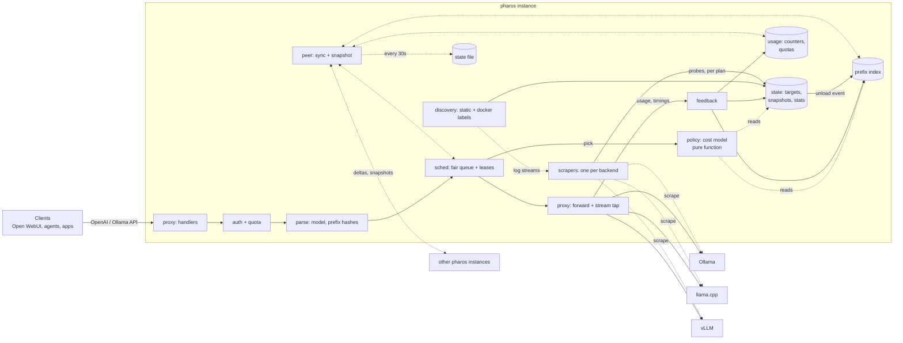
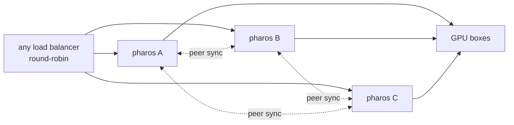

# Pharos architecture

Status: build steps 1–6 are implemented (§17). What is still design is marked where it appears (for example the `/metrics` series listed in §13 as not exported yet, and model aliases in §9). Read [STRATEGY.md](STRATEGY.md) first. That doc says *what* Pharos does and *for whom*. This one says *how*.

Design goals, in priority order:

1. **Correct signals.** Engine behavior is verified by tests, never assumed from docs. Unknown is never 0.
2. **Simple.** One binary, in-memory state, no database, no consensus, few dependencies, few knobs.
3. **Testable.** Routing decisions are pure functions. Time and I/O are injected. Every engine adapter has fixture tests and live integration tests.
4. **Performance-aware.** The hot path does no disk I/O and no network calls except the upstream request itself. It holds no lock while doing I/O and has a measured overhead budget.
5. **Available.** Any instance can crash, restart or be replaced in a rolling update without losing keys, usage or learned routing state. Instances share state without coordinating (§12).
6. **Modular.** Adding an engine means adding a recipe of mostly existing library probes, plus fixtures. Adding an engine version means adding fixtures, and a newer probe for each signal that changed. Operators can add their own probes in config. Adding a policy means adding one function.

Non-goals for v1: autoscaling or clusters beyond a handful of instances, strong consistency between instances, Kubernetes operator, KV-event routing, prefill/decode disaggregation, translating between API formats (e.g. Ollama-native → vLLM), plugins.

---

## 1. Overview



There are three planes:

- **Data plane (hot path):** handle a request, pick a target, stream the response back, record feedback.
- **Control plane (background):** discover backends, scrape engine signals and follow engine logs, maintain state.
- **Peer plane (background):** exchange state with other instances and persist it to the state file.

The data plane and control plane share state only through the `state` package: atomic snapshot pointers plus counters owned by the scheduler. The peer plane only talks to the data plane through a non-blocking channel (outgoing) and the owning packages' `Merge` functions (incoming).

**A single instance is a cluster of one.** Replication is not a separate mode. A single instance has no peers, and it still restores from its state file through the same merge code that multi-instance setups use.



---

## 2. Core concepts

| Term | Meaning |
|---|---|
| **Backend** | One engine endpoint: a base URL, an engine kind (`ollama`, `llamacpp`, `vllm`, …), the engine version if it exposes one, and its current plan. |
| **Target** | A pair of **backend × model**. This is the unit we route to and schedule on. Single-model engines (vLLM, SGLang) have one target per backend. Ollama, llama.cpp in router mode, and llama-swap have one target per model. Locally a target has a small integer ID. Between instances it is named by its **target key** `backend URL + model`. |
| **Signal** | One piece of engine state Pharos routes on: residency, running, waiting, capacity, KV usage, … A fixed vocabulary (§4). |
| **Probe** | One way to read one signal from one feed (an HTTP path or the backend's log stream). The unit of engine adapter code (§4). When an engine version changes a metric, a newer probe replaces the old one for that version. |
| **Recipe** | The ordered list of probes an engine kind *may* offer. |
| **Plan** | The probes that actually answered on one backend, at its current version, plus the operator's own probes. Discovered at runtime, per backend (§4). |
| **Scrape** | One round of the plan's HTTP probes against a backend, run on a timer. |
| **Snapshot** | An immutable set of signals from one scrape round of a backend, merged from its plan's probes. Every field is an `Opt[T]`, meaning a value plus a *known* flag. `From` records the probe that filled each signal. |
| **Lease** | A slot on a target, held for the duration of one request. The scheduler grants it. The request releases it along with feedback. |
| **Generation** | A per-target counter, incremented when the model is unloaded or reloaded. It invalidates that target's prefix-index entries in O(1). Generations are local to an instance and never sent to peers. |
| **Origin** | A random 64-bit ID chosen at process start. It tags everything this process counts. A restarted process gets a new origin, so it never has to recover its previous counts. |
| **Peer** | Another Pharos instance sharing state with this one. |

```go
type Opt[T any] struct { V T; OK bool } // OK=false means unknown. Never read V without OK.
```

---

## 3. Package layout

The layout is flat, with one responsibility per package and dependencies flowing downward only.

```
cmd/pharos/          main: flag parsing, wiring, subcommands (serve, doctor, keys)
internal/config/     YAML config → typed Config (env overrides: design); hot reload of keys and static backends
internal/engine/     Snapshot and Signal types, probe library, per-kind recipes, plan resolution, auto-detect, Prometheus text parser
internal/discovery/  static list + Docker label watcher → desired []BackendSpec, each with its log-stream opener
internal/state/      target registry, snapshot storage, EWMA stats, scrape and log-follow loops, generations
internal/prefix/     chained message hashing + bounded LRU index
internal/policy/     cost model: Pick(RouteReq, []Candidate) Decision. Pure, no I/O, no clock
internal/usage/      per-origin counters: usage history, RPM windows, daily token quotas
internal/sched/      admission, per-key fair queue, leases, inflight accounting
internal/proxy/      HTTP handlers, request parse, upstream forward, stream tap, feedback, drain
internal/peer/       peer membership, delta push, snapshot pull/merge, state file
internal/obs/        /metrics, /status page, /usage, decision logging
internal/fakeengine/ layer-3 engine doubles, cloned from recorded captures (§14)
internal/sim/        layer-5 routing simulator (§14)
```

Dependency direction: `cmd → obs, peer, proxy`; `obs → proxy, peer, sched, usage, state`; `peer → sched, usage, prefix, state`; `proxy → config, usage, sched → policy, prefix, state → engine`; and `discovery → state`. `proxy` reports finished requests through a callback (`Options.OnDone`) rather than importing `obs`.

- `policy` imports nothing from Pharos except its own input types. That keeps it trivially table-testable.
- Each replicated package (`prefix`, `usage`, `sched`, `state`) owns its own `Export`/`Merge` functions. `peer` only moves bytes and schedules merges; it has no merge logic of its own.
- There is no shared `types` package. Each type lives in the package that owns it.

**Dependencies (target: ≤ 3 outside the standard library):**

- `gopkg.in/yaml.v3`: config.

That is the only one. `/metrics` writes the Prometheus text format itself: a few counters, gauges and one histogram don't need `client_golang`. `// ponytail: hand-written exposition; switch to client_golang if we need its collectors or exemplars`

Deliberately *not* used:

- **A database (SQLite, Postgres).** Keys live in the config file. Usage is a set of small mergeable counters kept in memory, replicated to peers and saved to the state file (§11, §12). A database would only be a local copy of the same data.
- **Raft or other consensus (rqlite, dqlite, hashicorp/raft).** It needs 3 nodes for a quorum, puts a round-trip on every write, and adds failure modes (split brain, quorum loss) that a small team can't operate. None of our state needs agreement between instances (§12).
- **Docker SDK.** We call the Engine API directly over the unix socket with `net/http`.
- **Prometheus `expfmt` for parsing, or `client_golang` for exposing.** We read and write a few gauges and counters, so a small line parser with fixture tests and a small writer are enough.
- **Web frameworks.** `net/http` `ServeMux` patterns are enough.
- **testcontainers.** CI starts the engines with docker compose.

Standard library used: `net/http`, `log/slog`, `container/list`, `html/template`, `embed`, `encoding/csv`, `sync/atomic`, `encoding/gob`, `crypto/sha256`, `crypto/subtle`.

---

## 4. Engine adapters (`internal/engine`)

Engines differ in **how their state is read** and in **which usage fields their responses carry**. State is read by probes (this section). Response usage is read by the stream tap (§9) with the same rule, so it needs no per-engine code either, and it is fixture-tested per engine version in the same way.

**Engine behavior depends on the engine version, and it drifts one signal at a time.** A release renames one metric, adds one endpoint, or changes what one field means, and everything else stays the same. So the unit of adapter code is a **probe**: one way to read **one signal** from one feed. An engine adapter is not code. It is a combination of probes: the engine kind's recipe, plus any probes the operator adds in config. When a version changes one metric, a newer probe for that signal goes ahead of the old one and nothing else changes. The engine's name and version are metadata, not dispatch keys.

```go
type Signal uint8 // the fixed vocabulary; each one maps to one Snapshot field
const (
    Version Signal = iota    // per backend
    Models                   // which models the backend serves
    Residency                // per model: Loaded | Loading | Cold
    VRAMBytes, SizeBytes     // per model
    Running, Waiting, Capacity // per model, or "" = whole backend
    KVUsage                  // 0..1
)

type Probe struct {
    Name   string                        // "vllm-kv-cache-usage-perc"; shown by doctor and /status
    Signal Signal                        // the one signal it reads
    Feed   Feed                          // where its input comes from
    Parse  func(in []byte) (Snapshot, error) // in = a whole HTTP body, or one log line. Only Signal is read from the result
    When   func(version string) bool     // nil = any version. Only for semantic drift, see below
}

type Feed struct {
    Path string // HTTP GET, run each scrape round; probes on the same path share one GET
    Log  bool   // or: one line at a time from the backend's log stream (see Log probes)
}

type Plan struct {
    Kind    Kind
    Version Opt[string]
    Active  []Probe                      // own probes first, then recipe order
    Dropped map[string]string            // probe name -> why (404, status N, fetch error, parse error, no value, redundant, version guard, no log feed)
}

func Resolve(ctx context.Context, c *http.Client, base string, k Kind, own []Probe, logs bool) (Plan, Snapshot, error) // runs the whole recipe; logs = the backend has a log feed; errors only if the backend answers nothing
func (p Plan) Scrape(ctx context.Context, c *http.Client, base string) (Snapshot, error)                 // runs the active HTTP probes; a failing one is in the error
func (p Plan) Follow(ctx context.Context, logs io.Reader, emit func(Snapshot)) error                     // runs the active log probes on each line

var Recipes = map[Kind][]Probe{ // probes we trust per kind; order = priority when two probes read the same signal
    VLLM: {
        vllmVersion, openaiModels,
        Prom("vllm-running", "/metrics", Running, "vllm:num_requests_running", PerModel("model_name")),
        Prom("vllm-waiting", "/metrics", Waiting, "vllm:num_requests_waiting", PerModel("model_name")),
        Prom("vllm-kv-cache-usage-perc", "/metrics", KVUsage, "vllm:kv_cache_usage_perc", PerModel("model_name")),
    },
    LlamaCpp: {
        llamacppPropsVersion, openaiModels, llamacppPropsCapacity, // /props build_info, total_slots
        // llamacppModels (Models and Residency in router mode): no router-mode capture yet, so no probe
        Prom("llamacpp-running", "/metrics", Running, "llamacpp:requests_processing"),
        Prom("llamacpp-waiting", "/metrics", Waiting, "llamacpp:requests_deferred"), // When: build ≥ b8772; before it, 0 with a queue
        llamacppSlotsRunning, // /slots: the fallback when --metrics is off
    },
    Ollama:    {ollamaVersion, openaiModels, ollamaPSResidency, ollamaPSVRAM, ollamaTagsSize,
        ollamaLogNumParallel}, // LogLine on the startup "server config" line: OLLAMA_NUM_PARALLEL:N → Capacity
    LlamaSwap: {llamaswapVersion, openaiModels, llamaswapRunning},
    SGLang: {
        sglangVersion, openaiModels, sglangCapacity, // /get_server_info version, max_running_requests
        Prom("sglang-running", "/metrics", Running, "sglang:num_running_reqs", PerModel("model_name")),
        Prom("sglang-waiting", "/metrics", Waiting, "sglang:num_queue_reqs", PerModel("model_name")),
        // sglang:token_usage: no probe, it reads 0 under load from v0.5.11 on (captures)
    },
    OpenAI:    {openaiModels}, // generic: mlx-lm, LM Studio
    // TRT-LLM and LM Studio follow the same pattern once captured. STRATEGY §4 lists the
    // signals each one is expected to offer.
}

type Snapshot struct {
    At      time.Time               // stamped by the caller that owns the clock (state), not by Scrape
    Version Opt[string]             // engine version, if exposed
    Models  map[string]ModelInfo    // model -> residency
    Load    map[string]Load         // model -> occupancy; key "" = whole backend
    From    map[Signal]string       // signal -> probe that filled it (doctor, /status)
}
type ModelInfo struct {
    State     ResidencyState        // Unknown (zero value) | Loaded | Loading | Cold; a type apart from the Residency signal
    VRAMBytes Opt[int64]
    SizeBytes Opt[int64]            // needed to decide whether a cold load fits
}
type Load struct {
    Running, Waiting, Capacity Opt[int]
    KVUsage                    Opt[float64] // 0..1
}
```

Which probe supplies which signal on which engine version, and whether a live test asserts it, is in [SUPPORT.md](SUPPORT.md).

**Why recipes are still keyed by kind** when the plan already discovers which probes answer: running every probe against every backend would be simpler, but it isn't safe. Engines emulate each other's APIs for client compatibility (Ollama-style endpoints in particular [U: which engines, and how faithfully]). An emulated endpoint can return well-formed placeholder values, and a well-formed wrong value is exactly the failure Pharos exists to prevent. The recipe is therefore the list of probes we *trust* on that engine, in priority order. The kind also decides which native API routes the backend accepts (§9). The kind says what we trust; the plan says what answers.

`// ponytail: one kind per backend; a proxy that fronts another engine (e.g. llama-swap in front of llama.cpp) may need probes from both, add a composed recipe when a real setup needs it`

**The probe library** (`engine.Library`, every built-in probe that recipes draw from). Most probes are built from a few generic constructors, so behavior that several engines share is written once:

- `Prom(name, path, signal, metric, opts...)`: one metric from a Prometheus-text endpoint. Options name the label that splits it per model and the scale (percent vs 0..1). A value that can't be its signal (a fractional or negative count, KV usage outside 0..1, two series for one model) is an error, not a guess. NaN is unknown. vLLM, SGLang, llama.cpp and TRT-LLM differ only in the metric names they pass.
- `LogLine(name, signal, pattern, value)`: one regular expression. Its named group `value` holds the value, or `value` is a fixed value (e.g. `cold`) that a matching line reports. A named group `model` keys it per model. It reads Version, Residency and the Load signals; a bad pattern or a fixed value that can't be the signal is a config error, and a matching line with an unusable value is a parse error.
- `openaiModels`: `/v1/models`, which every tier speaks.
- Engine-specific JSON probes exist only where an engine has a JSON endpoint of its own. They are built on `jsonProbe`, which decodes the body into a struct (pointer fields tell absent from zero; a wrong type is an error). Shipped: `ollamaVersion`, `ollamaPSResidency`, `ollamaPSVRAM`, `ollamaTagsSize`, `llamacppPropsVersion`, `llamacppPropsCapacity`, `llamacppSlotsRunning`, `llamaswapVersion`, `llamaswapRunning`, `vllmVersion`, `sglangVersion`, `sglangCapacity`. Log probes: `ollamaLogNumParallel`. Not yet: `sglangLoads` (`/v1/loads`, redundant with `/metrics`, and absent before v0.5.8), `lmstudioModels` (no capture).
- Guards against emulation that a probe can make on its own: `ollamaVersion` rejects a version that doesn't start with a digit (llama-swap answers `/api/version` with `v260`), and `ollamaTagsSize` treats size 0 as unknown (SGLang serves `/api/tags` with `size: 0`). llama.cpp's Ollama-shaped `/models` would read as loaded under `ollamaPSResidency`; only the recipe keeps it out.

**A probe enters the library only after its metric, field or log line has been seen in a real capture** (ours or user-submitted), never from docs.

**Own probes.** Operators can add probes per backend in config (§10), using the same `Prom` and `LogLine` constructors. An own probe goes ahead of the recipe for its signal. This lets a team fix a renamed metric, or read an engine that has no recipe, without waiting for a Pharos release. Own probes are not in the fixture suite, and `doctor` and `/status` label them as own. Config parsing (`internal/config`) rejects an own probe with no name, a name that a library probe or another own probe of the backend already uses, an unknown signal, both or neither of `prom` and `log`, a `prom` probe for a non-Load signal, or a pattern that doesn't compile.

`// ponytail: own probes cover Prometheus metrics and log lines only; add a JSON-path kind when a user needs a JSON endpoint the library lacks`

**Merge.** A scrape round runs the HTTP probes of the backend's plan, with one GET per path. For each signal, the first probe in plan order that returns a known value wins, and `From` records which probe that was. `Resolve` applies this rule, so a plan holds one probe per signal; when a planned probe fails in `Scrape`, its signal is unknown for that round (the fallback was dropped as redundant) and `Scrape` returns the failure so the caller re-resolves. A model list that is present but empty is a known value (no models); a size list whose entries are all unknown is not. A signal that no probe knows stays unknown. Probes never make up defaults. A Residency probe answers with the list of models in memory (`/api/ps`, llama-swap `/running`), so a model that the Models signal knows but the winning Residency probe leaves out is Cold, and an empty list means every model is cold. A listed model in a state no capture has shown stays Unknown.

**The plan: discovered per signal, not per version.** `Resolve` runs every probe in the recipe, plus the backend's own probes. A probe is dropped if its path returns 404, it fails to parse, it yields no known value, or a higher-priority probe already reads its signal (redundant). The rest become that backend's **plan**, and later scrape rounds call only the plan's probes. Dropping redundant probes keeps scrape load within budget (§15). A fallback probe comes back through re-resolution if the preferred one fails. The plan is resolved again when `Version` changes, when a planned probe starts failing, and every 10 minutes. An engine upgrade that renames a metric or removes an endpoint therefore only changes which probes resolve. No per-version code runs.

`pharos doctor` prints the result of `Resolve` for each configured backend (or for one `-url`): kind, version, active probes with their values and sources (path, `log`, `own`), dropped probes with the reason, and which signals are unknown. With a log feed it also runs the plan's log probes over the log since the container started. `doctor -record <dir>` saves the raw body of every path in `engine.RecordPaths` (each library path plus the STRATEGY §4 candidates) in the layer-2 fixture format (§14); it is the only recorder, and `capture.sh` calls it for each state.

**Log probes.** A log line is just another feed. A log probe has the same shape as an HTTP probe, and its `Parse` gets one line instead of a body:

- **The feed.** v1 reads logs through the Docker Engine API over the socket that discovery already uses (`GET /containers/{id}/logs?follow=1&stdout=1&stderr=1&since=<State.StartedAt>`). Without a TTY the stream is multiplexed into 8-byte-header frames (observed on Docker 29.1.3 with Ollama 0.34.4; `internal/discovery` strips them). A backend found through Docker labels gets its feed automatically. A static backend gets one with `logs: docker://<container>` (§10), or, for an engine installed natively, `logs: file:///<path>`: the file is read from its start and followed by polling once a second; when it is replaced or truncated (a restart that rotates it), reading starts over on the new file. Native Ollama 0.32.15 on macOS writes the `server config` line to its log file too (live, 2026-09-29). A backend with no feed drops its log probes with the reason "no log feed".
- **In the plan.** A log probe can't return a 404. It stays active while the backend has a feed, unless a higher-priority probe already reads its signal. `doctor` shows it as "no match yet" until a line matches.
- **Values.** The feed starts at the container's current start, not at "now", because some useful lines are printed once at startup (Ollama's `server config` line). `Plan.Follow` emits a Snapshot per line that set a value, holding only that line's signals; a residency value covers only the model the line names. A log-derived value holds until a newer matching line replaces it, and it becomes unknown when the stream disconnects. Recipes put scraped probes first, so log probes fill signals and events that no endpoint shows. They don't replace scraped state.
- **Privacy.** Lines are matched in memory and dropped. Only the captured values (a model name, a number) are kept. Log lines are never logged, stored or sent to peers. `doctor --record` captures log lines only with `--logs`, and warns that engine logs can contain prompts.
- **What ships.** A built-in log probe ships only once its line is in a captured `engine.log` and the layer-4 test asserts its value. Shipped: `ollamaLogNumParallel` (Capacity). Other candidates seen in captures: llama-swap's `<model> Unloading model, TTL ... reached` and vLLM's periodic `Running: N reqs, Waiting: N reqs`; both are redundant with scraped probes. Ollama logs no load or unload line at INFO (0.34.4).

`// ponytail: Docker is the only log feed; add file tailing when someone runs engines outside Docker and needs log probes`

**Version guards are the exception.** They cover one case only: **the same name means different things in different versions**, where nothing in the payload tells the two apart (for example, a gauge that switches from percent to 0..1 without being renamed). Then the old and new meanings are two probes with complementary `When` ranges, and fixtures from both sides of the change prove them. If the version is unknown, neither guarded probe runs, so the signal stays unknown instead of possibly wrong. Every other kind of drift is handled without guards:

| Drift | Handled by |
|---|---|
| metric or field renamed | a newer probe for the new name, ahead of the old one in the recipe; the plan keeps whichever answers |
| endpoint added or removed | the plan: the probe resolves or doesn't |
| endpoint renamed | a newer probe on the new path, ahead of the old one |
| same name, new meaning | two probes with complementary `When` guards + fixtures on both sides; or, when the old meaning can't be read correctly at all, one guarded probe and the signal unknown before it (llama.cpp `requests_deferred` before b8772) |
| drift not yet in a release | an own probe in config |
| new engine | a recipe, mostly built from library constructors |

Rules for every probe:

- **A missing field, metric or log line means `OK=false`.** Never substitute a default. A metric that is present but unparseable is an error, and it is surfaced.
- **Probes don't touch shared state.** They return a value. `state` decides what to do with it.
- **Each library probe is proven by fixtures.** Its replay test runs against every recorded capture that contains its feed (§14).
- **A replaced probe stays in the recipe** for as long as we support an engine version that needs it.
- **Support matrix:** one row per engine version, one column per signal. A cell holds the probe that supplies that signal on that version (verified live, or by fixture only), or *unknown*.
- **`Kind: auto` detection** runs fingerprint probes in a fixed order, and the first kind whose probes all read a value wins: `llamaswapRunning` → llama-swap, `ollamaVersion` → Ollama, `llamacppPropsVersion` → llama.cpp, `vllmVersion` plus `vllmRunning` → vLLM, `sglangVersion` (`/get_server_info`, which only SGLang answers in the captures) → SGLang, else the generic `OpenAI` recipe. llama-swap comes first because v260 also answers `/api/version` (spike 2026-09-27); `ollamaVersion` also rejects its `v260`, so two checks guard that case. If no fingerprint matched and one of them got no answer at all (a fetch error, not a 404) or a 503, detection fails instead of falling back to `OpenAI`: an engine under load drops some requests (llama.cpp before b8772 with 8 requests on 2 slots), one that is loading its model answers 503 on every path (llama.cpp v0.5.0, `loading` capture), and a guessed kind would be wrong until the next re-resolve, up to 10 minutes later. The scraper retries next round. This is what makes zero-config Docker labels possible. Every capture dir is replayed through detection (`TestResolveCaptures`). The kind picks the recipe. The plan picks the probes. Targets come from the Models signal: one per model the backend lists, so a single-model engine gets one.

**Adding an engine** means adding a recipe from library constructors, a new JSON probe only where no constructor fits, `engine/testdata/<name>/<version>/<state>/` fixtures, a live integration test, and a row in the support matrix. **Adding an engine version** means recording a new fixture directory. Code changes only if a replay test fails, and then usually just one newer probe for the signal that changed.

---

## 5. State (`internal/state`)

```go
type Target struct {
    ID      uint16                      // small int: keeps prefix-index entries compact
    Key     string                      // backend URL + model: the name peers use
    Backend *Backend
    Model   string
    gen     atomic.Uint32               // bumped on unload/reload
    prefill, load, service ewma         // speed estimates, see Stats below
}

func (t *Target) View(now time.Time) View // signals as of now; stale ones unknown
```

- **One scraper goroutine per backend.** It calls `engine.Resolve` once, then `Plan.Scrape` on a ticker with jitter. A probe runs every 1 s if its signal is `Running`, `Waiting` or `KVUsage`, and every 5 s otherwise (residency, capacity, version): every fifth round runs the whole plan, the others only its load probes. Probes on the same path share one GET. Both intervals are options of `state.New`. The scraper re-resolves the plan on the triggers in §4. Each round publishes the backend's view (last full round, last load round, targets) with an atomic pointer swap; `Target.View(now)` derives a target's signals from it. Readers never block.
- **Targets** are registered on first sight, one per model the backend lists, and never removed, so IDs stay stable. A backend is *up* while its last full round is fresh and it isn't ejected. The proxy ejects a backend that refuses a connection or dies mid-reply, and cuts the client's connection when that reply had started; the next round it answers brings it back, so the scrape interval is the backoff. A dead backend logs once when it starts failing and once when it answers again.
- **Log follower.** If the plan has active log probes, the scraper starts a second goroutine that opens the backend's log feed (`BackendSpec.Logs`, through `Options.OpenLogs`, which `serve` points at `discovery.DockerLogs`) and runs `Plan.Follow`. It accumulates the values into its own immutable snapshot behind an atomic pointer, apart from the scraped view, so log values don't go stale with the scrape interval; `Target.View` takes a signal from it only when no scraped probe knows that signal. When the stream drops, the pointer is cleared (its values become unknown, never 0) and the follower reconnects with backoff (1 s doubling to 30 s). A log line that turns a model cold bumps the target's `gen`.
- **Every instance scrapes independently.** Scrape results are not replicated, because each instance needs fresh signals of its own and a peer's view would be older. N instances mean N× scrape load, which stays within budget (§15) for a handful of instances.
- **Staleness.** A scraped signal older than 3 × its interval is treated as unknown by the policy. A log-derived signal is unknown while its stream is disconnected (§4).
- **Residency transitions** bump the target's `gen`: a model that goes cold, a model that leaves the backend's list, and a new engine version. That lazily invalidates its prefix entries. `// ponytail: a reload seen only as a changed expires_at or digest doesn't bump gen yet; prefix correction catches the miss`
- **Stats** are exponentially weighted moving averages (EWMAs), updated from request feedback and not from scrapes:
  - `prefillSecPerTok`: the engine's own prefill time (llama.cpp `timings.prompt_ms`, Ollama `prompt_eval_duration`) per uncached prompt token, else streamed TTFT per uncached token on a warm dispatch. Only when both prompt and cached tokens are known and at least 256 are uncached: a nearly fully cached prompt measures fixed overhead (llama.cpp reports 20–100 ms for 1 uncached token in the captures). Engines that don't report cached tokens (Ollama before v0.33.3) never sample it and use the fleet value.
  - `loadSec`: Ollama's `load_duration` on a cold dispatch, otherwise its TTFT (a reply with no first byte has none). A cold dispatch whose engine-reported load took under 10 ms loaded nothing: residency was a scrape behind, and the sample counts as a warm one. Ollama 0.32.15 on Metal reports 0.5 ms warm and 0.55 s cold (Qwen2.5-0.5B, 2026-09-29). An Ollama chat or generate with no messages or prompt only loads or unloads the model (the ollama CLI's `rm` sends one with `keep_alive: 0`) and teaches nothing.
  - A successful reply newer than the last residency scrape shows the model loaded, so `View` reports it loaded until the next full round has the last word. Without that, requests in the gap after a load were dispatched cold, and their near-zero load times taught the router that loading is free.
  - `serviceSec`: request duration on warm dispatches, used to estimate queue wait.

  An EWMA with no samples is unknown, and the policy falls back to the fleet median, then to a config default. Stats are not synced continuously: behind a round-robin load balancer, every instance sees a similar sample of traffic. They are included in snapshots, so a new instance starts with its peers' estimates instead of none. A restored value is only used for a target that has no local samples yet.
- **Discovery** hands state a desired `[]BackendSpec` (`State.SetBackends`). State diffs it against the current set: a backend whose spec is unchanged keeps its state, new backends start scrapers, removed ones drain (no new leases; in-flight requests finish). A removed backend that comes back with the same spec gets its old state back (targets, stats, prefix entries): `docker restart` sends die then start, and the container is briefly missing from the running list (observed on Docker 29.1.3). The last 32 removed backends are kept for that. Readiness latches once the first set finished a round, so a backend discovered later doesn't make the instance unready.

---

## 6. Prefix index (`internal/prefix`)

This is a chained hash per message, not a character radix tree. It's less code, bounded memory, and never stores prompt text.

```
h0 = sha256(seed, model, tools)           // tools/system preamble render first in most templates
hi = sha256(h(i-1), role_i, content_i)    // a string content as its decoded text; fields length-prefixed; kept as 64 bits
```

- **The seed is fixed** (a constant), so hashes agree across instances and survive restarts. `hash/maphash` can't take a fixed seed, hence SHA-256.
- **Content is hashed as decoded text**, so a client that escapes non-ASCII as `\uXXXX` (Open WebUI's default serializer, Python's `requests` and `aiohttp`) and one that sends UTF-8 produce the same chain, and matched bytes are the text's bytes. Hashing the raw JSON counted an escaped Cyrillic character as 6 bytes instead of 2, so real cache hits were judged wrong predictions and pruned ([spike](spikes/2026-09-29-scenario-inputs.md#token-estimates-across-languages-and-json-escaping)). A content that isn't a string (an array of parts) is still hashed as sent.
- For `/v1/completions` and Ollama `/api/generate`, the prompt string is decoded the same way, split into fixed 1 KiB blocks and chained.
- **Entry:** `map[uint64]*list.Element`, plus LRU order. Each entry holds up to 4 `(targetID, gen, lastUsed, source)` slots, about 100 B per entry. `source` is how the slot's newest record arrived: `local` (this instance routed it), `peer` (a delta) or `restored` (a snapshot, from a peer or the state file). On a tie in `lastUsed` the first arrival keeps it. It exists only to measure prediction accuracy per source (§13). The default cap is 200k entries, roughly 20 MB.
- **Lookup:** walk `h_n … h_0`, longest first. Return, per target, the matched byte length and that slot's source, skipping slots whose `gen` is stale. The router converts matched bytes to estimated tokens at about 4 bytes per token. Measured on decoded text (Qwen2.5 and Llama 3.2 tokenizers, 2026-09-29), that ratio is 2.8–6.2 in English, Chinese, Russian and code, so the estimate is off by at most about 1.5×. That matters because the prefill estimate (tokens × learned seconds per real token) is weighed against wait and load times in seconds, and because a prediction is judged wrong below half of it.
- **Record:** after dispatch, add the target to every `h_i` of the request.
- **Correct:** if the response reports cached tokens far below the prediction, remove that target from the request's entries. This is how the index learns each engine's real retention without us modelling slots, block sizes or eviction.
- **Concurrency:** a single mutex. Lookup and record are O(messages) with no I/O.

  `// ponytail: one mutex; shard by hash if lock contention shows in benchmarks`

- **Known miss:** clients that re-encode JSON differently (key order, escaping) won't match each other. This is acceptable because the same client is consistent with itself.

**Replication.** The index is a *hint*: a wrong entry costs one cache miss, and correction then removes it. That makes it safe to replicate lossily, with no ordering guarantees:

- Every record and correction is also pushed, without blocking, onto the peer channel as a `PrefixOp{TargetKey, Hashes, LastUsed, Remove}`. If the channel is full, the op is dropped.
- `Merge(ops)` applies peer ops as local records and removals. It maps target keys to local IDs; ops for unknown targets are dropped. Merged slots are stamped with the receiver's *current* `gen` for that target. If a peer recorded an entry just before an unload that the receiver has already seen, the entry looks fresh by mistake; that costs one miss and correction removes it.
- `Export()` returns all live entries, most recently used first, for snapshots (§12).

---

## 7. Routing policy (`internal/policy`)

STRATEGY §3 lists the policy as ordered steps: residency, then workload, then prefix. Pharos implements them as **one cost: estimated time to first token (TTFT) in seconds.** The ordering emerges from the numbers rather than from hand-tuned thresholds.

```go
func Pick(r RouteReq, cands []Candidate, cfg Config) Decision

type RouteReq struct {
    PromptTokens int              // estimated: request bytes / 4
    Seed         uint64           // random per request; breaks exact ties
}

type Candidate struct {
    TargetID       uint16
    Warm           Opt[bool]
    Capacity       int          // slots per target: engine-reported, config, or the §8 fallback
    FreeSlots      int          // capacity - occupied (see §8)
    QueueAhead     int          // router waiters (all instances) + engine-reported waiting
    KVUsage        Opt[float64]
    MatchedTokens  int          // from prefix index
    PrefillSecTok, LoadSec, ServiceSec Opt[float64]
    FitsIfCold     Opt[bool]    // memory headroom check
    Loading        bool         // a load of the cold model is under way: counts as warm
}

type Decision struct {
    TargetID uint16
    Enqueue  bool            // all worth-it targets busy: wait in fair queue
    Reason   string          // "warm, 1.2k cached tok, est 0.4s vs 3.1s (cold)" → logs + status page
    Scores   []Score         // per candidate, for debugging and tests
}
```

**Cost per candidate:**

```
est_ttft = wait + load + prefill
  wait    = 0 if FreeSlots > 0 else (QueueAhead+1) / Capacity × ServiceSec
  load    = LoadSec if Warm is known false and not Loading, else 0 (infeasible if !FitsIfCold)
            (residency unknown = an engine that doesn't report it: its one model is always loaded)
            (Loading = requests in flight on the cold target, or the engine reports it loading: the
             load is paid, so a burst waits behind it instead of loading the model on a second host,
             until the wait there outweighs a load. ponytail: a joiner also waits for the rest of the
             load; count it if bursts on large models queue where a second host would be faster)
  prefill = (PromptTokens − MatchedTokens) × PrefillSecTok
  + KV pressure penalty when KVUsage > 0.9 (the cache is likely to be evicted, so trust the match less)
```

- Pick the lowest `est_ttft`. Costs within 1 ms tie; break ties on lower utilization, then randomly, so identical requests don't herd onto one target.
- If the best target has no free slot, return `Enqueue`.
- Unknown estimates fall back to the fleet median (over the candidates), then to `policy.Defaults`: 5 ms per prefill token (measured cold on CPU with Qwen2.5-0.5B, 3.1–15 ms, captures), 10 s per load and 5 s per request (not measured on real models [U]). A missing signal never becomes 0.

**Why a cost model rather than SMG-style thresholds:** it gives one comparable unit across heterogeneous hardware. Cache affinity turns into "prefill time saved", reload thrash into "load time paid", and imbalance into "wait". Prefix herding corrects itself, because piling onto the cached target raises its `wait`. It also yields a human-readable reason for every decision.

**`least-load` policy:** the same signature, scoring on utilization only. This is the escape hatch if the estimates misbehave on some fleet.

**Cold loads and memory:**

- `FitsIfCold` is true if the model's size is at most the configured host memory minus the VRAM already loaded. Loaded models with zero in-flight requests count as evictable.
- We never pick a cold load that would evict a model with in-flight requests.
- `// ponytail: coarse memory model (sizes from /api/tags), refine with real VRAM math if users hit OOM/evictions`

---

## 8. Scheduler (`internal/sched`)

The scheduler owns admission, inflight counts, and the fair queue. Within one instance, picking a target and acquiring a slot on it happen as one atomic step.

```go
func (s *Sched) Acquire(ctx context.Context, key string, r Request) (*Lease, error) // key: the API key's name; r.Weight: its share
func (l *Lease) Release(fb Feedback)
```

- **One mutex around pick + acquire.** `Acquire` builds candidates (from state snapshots, inflight counts and prefix lookups), calls `policy.Pick`, and either takes a slot or enqueues. Pick is microseconds and does no I/O, so serializing it is fine at small-team scale. Within an instance, this removes the whole class of races where two requests both see a slot as free.

  `// ponytail: global sched lock; per-model locks if routing throughput ever matters (>~5k rps)`
- **Occupancy counts everyone, not just us:**

  ```
  occupied = max(local_inflight + Σ live peers' inflight,  engine Running if known and fresh)
  ```

  The engine term covers clients that bypass Pharos, and peers that are partitioned from us. The peer term covers the 1–2 s the engine's metrics lag behind. "Fresh" also means no reply on the target ended since the fast scrape: until the next one, the engine's `Running` and `Waiting` still hold the slot that reply freed, so the local count is used. Otherwise the queue waits up to one fast interval for a slot that is free (llama.cpp b6890 in a 16-user cold burst: 4–6 slot-seconds idle per run while requests queued, none after). Peer inflight arrives every sync tick (§12). Two instances may grant the last slot within the same tick, which overcommits a target by at most N−1 requests. The engine queues the excess briefly. This is the price of not coordinating, and it's the same thing any engine does under load.
- **Fair queue.** Waiters are kept in per-key FIFOs and served round-robin across keys, weighted by the key's `weight` (deficit round-robin): a key keeps its turn until it has had as many grants as its weight, which also holds when slots free one at a time. When a slot is released, locally or by a peer (seen as its inflight dropping), the next waiter is re-run through `policy.Pick` with the freed slot now counted. A waiter can therefore land on a different target than the one it waited for, if that target is now better. Each instance keeps its own queue. Behind a round-robin load balancer each instance sees a share of every key's traffic, so fairness holds approximately across the cluster. A retry (§9 step 5) goes to the front of its key's FIFO: it already waited its turn, and an engine that refuses at once (llama.cpp without `--jinja`, to every request with `tools`) would otherwise send it to the back.
- **Waiting without a feasible target.** If every candidate is cold and loading it would evict a model with requests in flight, the request waits in the queue until one becomes evictable, rather than failing. It fails at once only when no up backend serves the model (404 for a model no backend lists, 503 otherwise). The queue is bounded (1000 waiters per instance, then 429).
- **Engine-freed slots.** Every scrape round kicks the queue, so a slot the engine frees (a client that bypasses Pharos finishing) serves the next waiter within one fast interval.
- **Capacity per target** is taken from the engine where reported (llama.cpp `total_slots`, SGLang `max_running_requests`), otherwise from config (for example Ollama's `OLLAMA_NUM_PARALLEL`). If neither is known, the target counts as saturated when the engine reports `Waiting > 0` or after 2 in-flight requests. That default is conservative and can be overridden.
- **Cancellation.** If the client disconnects, the context is cancelled: the waiter leaves the queue, or the upstream request is aborted (the engine stops generating) and the lease is released.
- **Quotas** are checked at admission through `usage` (§11): requests per minute and tokens per day, both summed across all instances.
- **Gauges for peers.** `Export()` returns this instance's inflight per target key and waiters per model. `Merge(origin, gauges)` replaces that origin's last report and re-runs the queue (a peer's freed slot); a report counts until the origin has been silent for 2 s. `Forget(origin)` drops it at once (a `Leaving` delta). Prefix records and corrections go to peers through `Config.OnPrefix`.

---

## 9. Proxy (`internal/proxy`)

**Routes:**

| Path | Backends |
|---|---|
| `/v1/chat/completions`, `/v1/completions`, `/v1/embeddings` | any engine (all tiers speak OpenAI-compatible) |
| `/v1/models`, `/v1/models/{id}` | aggregated model list; one model (404 if no up backend serves it) |
| `/api/chat`, `/api/generate`, `/api/embed` | Ollama backends only (v1: no API translation) |
| `/api/tags`, `/api/ps` | aggregated across Ollama backends (Olla returns 501 for `/api/ps`) |
| `/api/show` | forwarded to an up Ollama backend serving the model; takes no slot |
| `HEAD /`, `GET /`, `/api/version` | `Ollama is running`; the oldest version among up Ollama backends (clients gate features on it). No key: the ollama CLI sends `HEAD /` before every command and never sends `Authorization` (0.32.15, live) |
| other `/api/*` (`pull`, `delete`, `create`, …) | 501 in Ollama's error shape, which the CLI prints: Pharos doesn't manage models |
| `/metrics`, `/healthz` | Pharos itself, no key needed |
| `/status`, `/usage` | Pharos itself, admin key required (open when no keys are configured) |

Peer endpoints are served on a separate listener (§12), never on the public one.

**Request path:**

1. **Auth.** Look up the bearer key's SHA-256 in an in-memory map built from the config file (§10). The map is swapped atomically on config reload. There is no I/O per request. With no keys configured, every client is let in as one anonymous key (logged at startup). A missing or unknown key gets 401 `invalid_api_key`; a model outside the key's `models` allow-list gets 404 `model_not_found`, and `/v1/models` lists only the models the key may use. Then admission (§11): over the key's requests per minute gets 429 `rate_limit_exceeded`, out of daily tokens 429 `insufficient_quota`, both with `Retry-After` (the next minute, or the next midnight in `usage.timezone`). Error bodies are OpenAI-shaped, `{"error": {"message", "type", "code"}}`, with OpenAI's codes where one fits, because SDKs read `code`.
2. **Parse.** Read the body once, bounded (default 32 MiB, for base64 images), into a pooled buffer. Decode only `model`, `messages[].role` and `messages[].content` (as `json.RawMessage`), `tools`, `prompt` and `stream`. Compute the prefix hash chain and estimate prompt tokens. A streamed `/v1/chat/completions` request without `stream_options.include_usage: true` gets it set (the body is re-encoded; see **Usage on every stream** below).
3. **Acquire** a lease (§8).
4. **Forward** with a plain `http.Client` and a copy loop (not `httputil.ReverseProxy`, so a refused connection or a 5xx can be retried before anything is written):
   - the copy flushes after every read, so SSE and Ollama NDJSON stream token by token;
   - a shared `http.Transport` with keep-alive (`MaxIdleConnsPerHost` 64) and compression off, so the tap sees plain bytes; the client's `Authorization` and `Accept-Encoding` are not forwarded;
   - no response-header timeout yet: a warm non-streamed Ollama reply sends its headers only when done [U], so a short one would cut it. `// ponytail: add per-decision header timeouts (long for cold loads) once engines' header timing is measured`;
   - no overall body timeout, because streams can be long.
5. **Retry** once, on another target, only if nothing has been written to the client yet (connection refused, or a 5xx from the engine). After the first byte there are no retries. A refused connection ejects the target; a 5xx doesn't, since the engine may refuse only some requests (llama.cpp b6890 without `--jinja` answers every request with `tools` 500 at once, and serves the rest). A request the engine answered with an error status makes the prefix index forget that prompt on that target, or a target that fails at once would win the same prompt again by affinity.
6. **Tap.** Wrap the upstream body in a line scanner that passes bytes through (holding a partial line until its newline only when it strips, below) and remembers only the last usage-bearing JSON line (lines up to 64 KiB; longer lines pass through unparsed, so a huge one-line non-streamed reply gives no usage). The parser is `engine.ParseUsage`, replayed on every recorded stream (`TestReplayUsage`). It extracts the union of known fields. The field list is data and follows the probe rule (§4): each usage value has an ordered list of fields, a newer field name goes ahead of the old one only after a recorded stream shows it, and recorded response streams per engine version prove it (§14):
   - OpenAI: `usage.prompt_tokens`, `usage.prompt_tokens_details.cached_tokens`
   - llama.cpp: `timings.cache_n`, `timings.prompt_n` (both in every build from b6602 to v0.5.0; `usage.prompt_tokens_details.cached_tokens` only from b8772)
   - Ollama: `prompt_eval_count` (v0.30.0 counts only uncached tokens there), `prompt_eval_cached_count` (from v0.33.3), `load_duration`, `prompt_eval_duration`
   - completion tokens: `usage.completion_tokens`, then llama.cpp `timings.predicted_n`, then Ollama `eval_count` (all three in every recorded stream). Embeddings generate none, so their completion count is 0, not unknown.
7. **Feedback.** Release the lease along with TTFT (time to first body byte), duration, usage and cached tokens. That updates stats and corrects the prefix index. The request's usage goes to this origin's usage counters (§11) once, on the attempt the engine answered, and the finished request goes to `obs` (`Options.OnDone`) with its status, target and reason.

**Usage on every stream.** An OpenAI-style stream carries usage only when the client sets `stream_options.include_usage`, and quotas need the token counts of every request (§11). So when a streamed chat request doesn't ask for it, Pharos sets it (keeping the client's other `stream_options`) and the tap drops the usage-only chunk from the reply: the `data:` line whose `choices` is an empty list, and the blank line that ends its event. Every recorded engine version sends usage exactly that way (Ollama, llama.cpp, llama-swap, vLLM, SGLang, mlx-lm; `TestTapStripReplaysRecordedStreams`), so the client gets the recorded stream minus that one chunk. A client that asked for usage gets the stream untouched. `/v1/completions` streams aren't recorded yet, so Pharos doesn't touch them, and their usage stays unknown unless the client asks for it. Whether the other chunks match what the engine sends without the option was compared by hand once (2026-09-28, streams with the option off, direct vs through Pharos): Ollama 0.34.4 byte-identical; vLLM v0.30.0 identical except that turning the option on moves `system_fingerprint` from the last content chunk to the usage chunk, so a client of Pharos doesn't get it. This is accepted rather than worked around: keeping the field would mean holding back every chunk until the next one arrives, or sending a chunk with empty `choices` that some SDKs reject. A client that needs the field asks for usage itself (README), which gets it the untouched stream with the fingerprint on the usage chunk. Pharos keeps asking for usage on everyone else's behalf, because without it those requests would be unmetered and skip token quotas. In the captures (all recorded with the option on), llama.cpp, llama-swap, Ollama and mlx-lm put `system_fingerprint` on every content chunk, so stripping loses nothing there; SGLang and vLLM before v0.30.0 don't send it. The option-off comparison is still **[U]** for the other engines; in the captures SGLang v0.5.5.post3 and v0.5.8 also put `"usage":null` on every content chunk with the option on.
`// ponytail: re-encodes the body; do a targeted byte insert if it shows in profiles`

Feedback is still best-effort: a response with no usage leaves the stats unchanged, and its usage counts as unknown, never 0.

**Model names.** v1 routes exact names only. An optional alias map (design, not built) (e.g. `llama-8b` → `ollama:llama3.1:8b`, `vllm:meta-llama/Llama-3.1-8B-Instruct`) rewrites `model` when forwarding.
`// ponytail: alias rewrite re-encodes the body; do a targeted byte rewrite if it shows in profiles`

**Readiness and drain.** Together these make restarts and rolling updates invisible to clients:

- `/healthz` returns 503 until state is restored (§12) and the first scrape round has finished, so a new instance never routes blind.
- On SIGTERM: `/healthz` turns 503; the instance keeps accepting requests for `drain.grace` (default 5 s) so the load balancer notices; it then stops accepting and waits for in-flight streams up to `drain.timeout` (default 10 min, longer than the longest generation); finally it sends a last delta marked `Leaving` (with its usage cells), writes the state file and exits. A second signal ends the process at once. Checked by hand on Ollama 0.34.4 (2026-09-28): a 300-token stream in flight at SIGTERM finished with `[DONE]`.

---

## 10. Config and discovery (`internal/config`, `internal/discovery`)

```yaml
listen: :8090
policy: cost              # or least-load
backends:
  - url: http://gpu-box:11434
    kind: auto            # or any recipe: ollama | llamacpp | llama-swap | vllm | sglang | openai (trtllm, lmstudio once they have one)
    memory_gb: 24         # Ollama doesn't report total VRAM
    capacity: 4           # per target, if the engine doesn't report it
  - url: http://gpu-box:8000
    kind: vllm
    logs: docker://vllm-1 # optional log feed for log probes (or file:///path/to/engine.log); Docker-label backends get one automatically
    probes:               # optional own probes (§4); each goes ahead of the recipe for its signal
      - name: my-vllm-running
        signal: running
        prom: {path: /metrics, metric: vllm:num_requests_running, per_model: model_name}
      - name: my-model-loaded
        signal: residency
        log: {match: 'model (?P<model>\S+) loaded', value: loaded}
keys:
  - name: alice           # unique; usage is recorded by name
    sha256: 9f86d081…     # printed by `pharos keys new --name alice`
    rpm: 60
    tokens_per_day: 2000000
    weight: 1             # fair-queue share
    models: []            # optional allow-list
  - name: ops
    sha256: 2c26b46b…
    admin: true           # may read /status and /usage
state_file: /data/pharos.state   # optional; recommended for single-instance setups
usage:
  timezone: UTC           # day boundary for tokens_per_day and daily usage
  retention_days: 400
drain:
  grace: 5s               # /healthz fails, requests still accepted
  timeout: 10m            # then in-flight requests get this long
peers:                    # optional; omit for a single instance (§12)
  listen: :8081
  secret_file: /run/secrets/pharos-peer
  members: [pharos-a:8081, pharos-b:8081, pharos-c:8081]   # may include self
  # dns: pharos-peers.default.svc.cluster.local           # k8s headless Service, instead of members
```

- **Keys live in config.** `pharos keys new --name alice` prints the key once, together with the YAML entry that holds its SHA-256. The key itself is never stored. Every instance reads the same file (a mounted volume, a k8s Secret or ConfigMap, or GitOps). There is no key database to replicate and no admin HTTP API.
- **Hot reload.** The config file is re-read when its modification time changes (checked every 10 s). Keys, quotas and static backends (including their own probes, which trigger a re-resolve) apply live. Changed `listen`, `policy`, `state_file`, `peers`, `usage` or `drain` are logged as needing a restart. A file that doesn't parse is logged and the running config stays.
- **Unknown fields are errors,** so a typo (`per-model` for `per_model`) fails at startup or reload instead of dropping a setting.
- **Own probes are shared with YAML anchors** when several backends need the same one. There is no separate probe registry.

**Docker labels.** When the Docker socket answers (`DOCKER_HOST=unix://…` or `/var/run/docker.sock`, mounted read-only), Pharos watches the Engine API events stream for containers labeled `pharos.enable=true`, lists the running ones after every event, and adds each as a backend with the container's log stream as its log feed (§4). It combines them with the static list; with the socket, the static list may be empty. Zero-config is `pharos.enable=true` alone:

| Label | Default |
|---|---|
| `pharos.enable` | required, `"true"` |
| `pharos.url` | `http://<container IP>:<port>`, the IP from the container's first network by name |
| `pharos.port` | the container's one exposed TCP port; required when it exposes several |
| `pharos.kind` | `auto` |
| `pharos.memory_gb`, `pharos.capacity` | unset, as in the static list |

A container whose labels don't make a backend (an unknown kind, several ports and no `pharos.port`) is left out and logged once. Set `pharos.url` when Pharos runs on the host or shares a different network with the engine.

```yaml
services:
  ollama:
    image: ollama/ollama
    labels:
      pharos.enable: "true"
      pharos.memory_gb: "24"
```

**Multiple instances need the same backends and keys.** Docker label discovery only sees the local Docker host, so it suits a single instance, or instances on the same host. Multi-host setups should use the static list. Peers exchange a fingerprint of their static backend set and key set (Docker-discovered backends are per host and left out); a reload updates it. A mismatch is logged and shown by `Node.Status` (for `/status` and a metric once `obs` exists), instead of silently routing differently.
`// ponytail: docker discovery is per-host; share discovered backends over peer sync if multi-host Docker users ask`

---

## 11. Usage and quotas (`internal/usage`)

Usage history and quota counting use one mechanism: **per-origin counter cells**.

```go
type Cell struct {
    Origin  uint64   // the process that counted it
    Kind    uint8    // Day | Minute
    Bucket  int64    // day number in usage.timezone, or unix minute
    Key     string   // key name
    Model   string   // "" for Minute cells
    Requests, PromptTok, CachedTok, CompletionTok uint64
    Unmetered uint64 // served requests whose reply reported no prompt or completion count
}
```

- **A process only ever increments its own origin's cells.** Cells from other origins are read-only copies.
- **Merge** keeps the field-wise max per `(Origin, Kind, Bucket, Key, Model)`. That makes it commutative and idempotent: deltas may arrive late, twice or out of order, and the result is the same.
- **Totals** are a sum over origins. Cells of departed origins (a crashed or replaced instance) stay, so their usage is never lost as long as any instance or state file holds them.
- **Tokens per day** for a key = the sum of today's `Day` cells for that key (prompt + completion tokens).
- **Unknown usage is unmetered, not 0.** A reply without token counts (a `/v1/completions` stream that didn't ask for usage, an engine that died mid-stream, a one-line reply over 64 KiB) adds to `Unmetered`, which `/status`, `/usage` and `/metrics` show. Quotas can only count known tokens, so an unmetered request is visible but doesn't use up quota. Pharos asks OpenAI chat streams for usage (§9), which keeps this rare.
- **Requests per minute** count at admission, so a burst is limited before it reaches an engine; a rejected request isn't counted. Tokens count when the reply ends.
- **The RPM window** is a sliding-window estimate over `Minute` cells: `prev_minute × (1 − elapsed fraction) + current_minute`. `Minute` cells older than 2 minutes are dropped and never persisted.
- **Across instances, quotas are approximate.** While the instances are connected, a key can overshoot by up to one sync tick of traffic per instance (§12). While they are partitioned, each side enforces the quota on the usage it can see, so the cluster can admit up to one full quota per side for as long as the partition lasts; the counts merge when it heals. This is accepted: quotas are for fairness, and Pharos does not do billing. Operators see a partition through `pharos_peer_last_heard_timestamp_seconds` (§13) and can alert on it.
- **History** is `Day` cells kept for `usage.retention_days`. Size: 20 keys × 10 models × 400 days is 80k cells per origin that was active on those days, a few MB. `/usage?from=YYYY-MM-DD&to=YYYY-MM-DD&by=key|model&format=csv` returns JSON (the default: the last 30 days by key) or CSV; `/status` shows today and the last 30 days.
- **Prometheus users** also get `pharos_tokens_total{key,model,type}` from `/metrics`. Prometheus's `sum(increase(...))` handles restarts and multiple instances natively.

**Durability.** With peers, a crash loses at most one sync tick of that instance's usage (§12). Without peers, it loses at most one state-file interval (30 s). A graceful shutdown loses nothing. Requests still streaming when a process crashes produce no feedback, so they are never counted.

---

## 12. Peers and availability (`internal/peer`)

Pharos gets high availability without consensus. **Every piece of shared state has a merge rule that needs no agreement between instances:**

| State | Owner | Merge rule | If sync fails |
|---|---|---|---|
| Prefix index | `prefix` | Apply ops as local records/removals; bounded LRU | Worse cache affinity; correction repairs wrong entries |
| Inflight per target, waiters per model | `sched` | Per origin: latest report replaces the previous one; dropped after 2 s of silence | Occupancy falls back to local count + engine `Running` |
| Usage and quota cells | `usage` | Per cell: field-wise max; totals sum over origins | Each side enforces quotas on what it sees (up to one quota per side); history catches up on reconnect |
| Stats (EWMAs) | `state` | Snapshot only; used for targets with no local samples | New instance learns from its own traffic |

When sync fails, **each instance behaves exactly like a standalone instance.** A partition therefore lowers routing quality but can't corrupt state or stop serving.

**Protocol.** Full mesh, push-based, over HTTP on `peers.listen`:

```go
type Delta struct {          // POST /peer/delta, every tick (200 ms)
    Proto       uint16       // wire version; a peer on an incompatible version answers 409, and the sender flags it (pharos_peer_proto_mismatch)
    Origin      uint64
    Fingerprint uint64       // hash of backend set + key set (§10)
    Leaving     bool         // sent on shutdown: drop my gauges now
    Gauges      sched.Gauges // this origin's full current inflight/waiters
    Cells       []usage.Cell // this origin's cells: today + yesterday, current + previous minute
    Prefix      []prefix.Op  // records and corrections since the last tick (lossy)
}

type Snapshot struct {       // GET /peer/snapshot; also the state file
    Proto  uint16
    Prefix []prefix.Entry    // by target key, most recent first
    Cells  []usage.Cell      // Day cells of all origins, within retention
    Stats  []state.TargetStats
}
```

- **Encoding:** `encoding/gob`. It ignores unknown fields, so mixed versions during a rolling update interoperate; `Proto` is bumped only for breaking changes. `Cells` was added that way, without a bump: the proto-1 samples recorded before it still decode (`TestWireFormatDecodes`).
- **Auth:** a shared secret sent as a bearer token and compared with `crypto/subtle`. Pharos refuses to start peers without one. The peer listener belongs on a private network. `// ponytail: plain HTTP between peers; add peers.tls cert/key when someone runs peers across an untrusted network`
- **Membership:** from `peers.members`, or by re-resolving `peers.dns` every 10 s (a name without a port takes the port of `peers.listen`). Every peer response carries the answering instance's origin in a `Pharos-Origin` header; a member whose origin equals our own is ourselves and is skipped. `// ponytail: full mesh; fine for ≤ ~5 instances, switch to gossip if someone runs more`
- **Deltas carry absolute values** of this origin's counters, not increments. A lost delta is repaired by the next one, so there is nothing to acknowledge or retry. Only prefix ops are lossy, and those are hints.
- **The hot path never waits on peers.** The scheduler hands each prefix op to `peer.Node.Push`, which appends it to every peer's bounded pending list (10k ops) under a short lock, and drops it when the list is full. One sender goroutine per peer builds a delta each tick, so a slow peer delays only itself. Received deltas are merged by the owning packages under their existing locks.

**One restore mechanism for three cases.** Merging is idempotent, so restoring from several sources is always safe:

1. **Startup:** after the first scrape round (so prefix entries find their targets; stats wait for targets not seen yet), merge the state file if one exists, then merge a snapshot from every reachable peer (with a 5 s timeout overall). The peer listener opens first, so instances starting together can pull from each other; the public listener opens only after the restore.
2. **Reconnect:** when a peer that was unreachable (or new) answers again, pull its snapshot and merge it. This heals anything missed during a partition, including cells of instances that died meanwhile.
3. **Warm restart without peers:** the state file is the `Snapshot` format, written every 30 s and on shutdown (write to a temp file, then rename). This is how a single docker-compose instance keeps its prefix index and usage across upgrades.

**Deploying with peers:**

- 2–3 instances behind any round-robin load balancer. Because prefix and occupancy are shared, no stickiness is needed.
- Kubernetes: a Deployment with `maxUnavailable: 0, maxSurge: 1`, so a live peer is always there to bootstrap from; a headless Service for `peers.dns`; and `terminationGracePeriodSeconds` greater than `drain.grace + drain.timeout`. No PersistentVolume is needed, because peers hold the state. Losing every instance at once loses the state unless a `state_file` is on a volume.
- docker-compose on 2–3 hosts: a static `peers.members` list plus keepalived or DNS in front.

---

## 13. Observability (`internal/obs`)

- **`/metrics`** (Prometheus text format, no key needed):
  - `pharos_requests_total{key,model,status}` (status 499: the client left first), `pharos_tokens_total{key,model,type}` (prompt, cached, completion; this instance's requests, so Prometheus's `sum(increase(...))` totals the cluster), `pharos_unmetered_requests_total{key,model}`;
  - `pharos_ttft_seconds{model}`: a histogram of time to the first engine byte; `pharos_overhead_seconds`: a histogram of Pharos's own time before the first upstream send (auth, admission, body read, prefix lookup, routing; queue wait excluded), against the 2 ms p99 budget (§15);
  - `pharos_decisions_total{stage,outcome}`: every branch a request or a background round takes, one count per branch, from a fixed set of values so the series stay few. The request path records them on `proxy.Done`, and its debug log line carries the same list. Background rounds report theirs through `state.Options.OnDecision` (backend, stage, outcome), one debug log line each. A new decision branch gets a row here in the same change:

    | stage | outcomes | notes |
    |---|---|---|
    | `admission` | `ok`, `unauthorized`, `bad_request`, `too_large`, `model_not_allowed`, `rate_limited`, `quota_exceeded` | |
    | `usage` | `pharos_asked`, `client_asked` | streamed chat only: whether Pharos added `include_usage` (§9) |
    | `route` | `only_choice`, `least_loaded`, `affinity`; `unknown_model`, `unavailable`, `queue_full`, `client_left` | why the target won (`policy.Decision.Why`: `affinity` = cache or warmth outweighed load), or why none did; once per attempt |
    | `queue` | `immediate`, `waited` | whether the request waited in the fair queue; once per attempt |
    | `load` | `cold_start`, `unexpected_load`, `control` | `cold_start`: the dispatch paid a model load. `unexpected_load`: dispatched as warm, but the engine reports it loaded the model (residency was a scrape behind an unload); learned as load time. Only engines that report a load time (Ollama's native API) can show it. `control`: an Ollama chat or generate with no messages or prompt, which only loads or unloads the model (the ollama CLI's `rm` and `stop` send one); forwarded, and not learned from |
    | `prefix` | `predicted_hit`, `wrong_prediction`, `unpredicted_hit`, `miss`, `unknown` | the prefix index's prediction against the engine's cached tokens (§6); `wrong_prediction` is the one it corrects; `unknown` = the engine reported no cached tokens |
    | `upstream` | `ok`, `error_status`, `connect_failed`, `busy_retried` (503), `error_retried` (other 5xx), `died_mid_reply`, `client_left`, `pharos_error` | `connect_failed` and `died_mid_reply` eject the backend, so they count ejections |
    | `resolve` | `new_plan`, `same_plan`, `failed` | background: probe choice. `new_plan` = the active probes changed (or the first plan), also logged at info with the active and dropped probes |
    | `scrape` | `ok`, `probe_failed`, `new_version`, `unreachable` | background, per round that scrapes: `probe_failed` (a planned probe failed, the rest published) and `new_version` trigger a re-resolve; `unreachable` keeps the last view until it goes stale |
    | `generation` | `unloaded`, `unlisted`, `new_version` | background: why a target's generation was bumped, which invalidates its prefix entries (§5); `unloaded` also from a log probe |
    | `log_feed` | `connected`, `ended`, `open_failed` | background: the backend's log feed (§4); `ended` only after `connected`, not on shutdown |
  - per backend: `pharos_backend_up{backend,kind,version}`, `pharos_backend_log_feed_up`, `pharos_backend_probes_active` (a change after an upgrade is how engine drift shows up in production);
  - `pharos_prefix_predictions_total{source,outcome}`: the `prefix` decisions of requests that had a prediction (outcome `predicted_hit`, `wrong_prediction` or `unknown`), by where the matching slot came from (`local`, `peer`, `restored`; §6). `predicted_hit / (predicted_hit + wrong_prediction)` per source says whether peer-shared and restored entries are as trustworthy as local ones;
  - per target: `pharos_target_inflight` (this instance), `pharos_target_inflight_cluster` (this instance plus what peers reported within 2 s: the occupancy routing counts before an engine's own Running raises it; it differs from `sum(pharos_target_inflight)` when a peer is cut off) and `pharos_target_signals_unknown` (how many of residency, running, waiting, capacity and KV usage are unknown now);
  - `pharos_queue_waiting`; per peer: `pharos_peer_up`, `pharos_peer_mismatch`, `pharos_peer_proto_mismatch` (it refused our deltas with 409, an incompatible wire protocol, so the two share no state; kept while it is unreachable, cleared by its next accepted delta), `pharos_peer_dropped_prefix_ops`, `pharos_peer_last_heard_timestamp_seconds` (when its last delta arrived; absent until the first one, when `pharos_peer_up` tells the story). `time() - pharos_peer_last_heard_timestamp_seconds` is how long this instance's quotas and routing have been missing that peer's traffic; the README gives alert rules.
- **`/status`:** one server-rendered `html/template` page with no JS build, refreshed every 10 s. It shows each backend with its detected engine kind, version and resolved plan (every active probe with the signal it fills and its value, own probes labeled, dropped probes with the reason), how long ago its full and load rounds ran, each target's residency, load signals (unknown shown as unknown), inflight here and cluster-wide, and speed estimates, the last 50 requests with their key, status, target, `Reason` and token counts, the peers with their state (an incompatible protocol shown as such), and usage by key for today and the last 30 days.
- **Logs:** `log/slog`. One line per request at debug level (`serve -log-level debug`): the client's `X-Request-Id` if it sent one, key, model, target, reason, its decisions as `stage=outcome` pairs, status, TTFT, overhead, duration). **Prompt content is never logged,** and neither are engine log lines read by log probes (§4).

---

## 14. Testing strategy

Five layers, fastest first. Everything except layer 4 runs on `go test ./...` with no network.

**Truth flows down, from engines and from clients.** Layer 4 observes real engines and records what they serve; layers 2 and 3 replay it. Clients are third-party too: Open WebUI, the OpenAI SDKs and the `ollama` CLI differ in how they encode bodies, which routes they call first and which headers they send. Two outside-in bugs came from there (the CLI's `HEAD /`, and `\uXXXX`-escaped text breaking prefix feedback), because every test request is built by Go's `json.Marshal`. Recording what real clients send, and replaying it through the proxy, is the biggest gap in this strategy (*client captures* below; one client so far).

| Layer | What | How |
|---|---|---|
| 1. Unit (pure) | `policy.Pick`, prefix index, Prometheus text parser, `Prom` and `LogLine` constructors, own-probe config parsing, plan merge and redundancy rules, stream tap line scanning, fair-queue ordering, EWMAs, RPM window, every `Merge` | Table tests. Time is injected (`now func() time.Time`), so there's no sleeping. Merges get property tests (`testing/quick`): applying deltas in any order, any number of times, gives the same state. |
| 2. Fixture replay | Each library probe against every recorded capture that contains its feed; `Resolve` against each whole capture (expected plan and snapshot); `Follow` against recorded log lines; the stream tap against recorded response streams; peer wire formats | `engine/testdata/<engine>/<version>/<state>/` (e.g. `idle/`, `loaded/`) holds **raw** bodies for every path in the recipe (`/api/ps` → `api_ps`), plus `paths.tsv` with each path's status and content type, 404s included, plus recorded response streams, recorded log lines (`engine.log`, reviewed for prompt content before commit) and `meta.yaml` (engine version, capture date, capture command). Never parsed `Snapshot`s. Expected values live in the Go test files, keyed `engine/*` (every version), `engine/*/state`, `engine/version` or `engine/version/state`; the most specific key wins, so a behavior every version shares is written once and a new version needs rows only where it differs. A probe that isn't expected to match a capture must yield no known value, which catches one engine's probe matching another engine's metrics. Adding a version means adding a directory. `peer/testdata/proto<N>/{delta,snapshot}.gob`, recorded by the release that introduced wire version N, proves that each release decodes the earlier releases' messages and state file (`TestWireFormatDecodes`). |
| 3. Component | proxy + sched + policy + state + peer together | In-process **fake engines** (`internal/fakeengine`, `httptest`) for Ollama, llama.cpp and vLLM. Every body they serve (status endpoints and stream lines) is cloned from the pinned version's capture with the fake's numbers put in, and `TestFakeResolvesLikeItsCapture` checks that `Resolve` reads a fake exactly as it reads that capture. Only the latency, memory and cache model is synthetic: prefill cost per uncached token (4 bytes of the decoded text per token, so an escaped and a UTF-8 body are the same prompt, as for a real engine), load delay when cold, LRU unloading under memory pressure, and an LRU prefix cache. They serve every reply shape the pinned capture recorded (`streams/`): streamed and non-streamed chat, non-streamed completions and embeddings, and for Ollama its native chat, generate and embed; a request the engine refused in the capture (embeddings on a chat server) gets the recorded refusal (`TestFakeServesEveryRecordedReply`). `Hold` keeps requests running without sleeping. Multi-instance tests (`internal/peer`) run 3 Pharos instances in one process over an in-memory transport that can cut an instance off (a crash or a partition), with ticks stepped by hand. The rolling restart (`TestRollingRestartUnderTraffic`, `cmd/pharos`, build tag `integration`) runs 3 real `serve` loops on real sockets and a real clock, since drain lives in `serve`; it needs no Docker and takes ~15 s. |
| 4. Live integration | Real engines, behavior assertions | Build tag `integration` (`internal/engine/live_test.go`). Each engine starts from its docker compose profile in `test/engines/<engine>/`, on CPU with Qwen2.5-0.5B (vLLM uses its CPU image, which has an arm64 build). `test/engines/capture.sh` drives it through idle → loaded → busy → cold → saturated → cancelled plus a repeated long prefix, then records the other replies clients ask for (non-streamed chat and completion, embeddings, Ollama's native generate and embed; `streams/replies.tsv` holds each status), and records each state with `pharos doctor -record`, the one recorder. The Go test then runs `Resolve` and `Scrape` on the bodies the engine just served, runs `Follow` over its log, and asserts behavior (see below). By default the capture goes to a temp dir; with `PHAROS_RECORD=1` it rewrites `testdata/<engine>/<version>/`, and the fixture diff shows up in the PR. `PHAROS_LIVE_ENGINES` picks engines, `PHAROS_LIVE_VERSION=latest` runs each engine's latest release instead of its pinned one. |
| 5. Benchmarks & simulation | Overhead budget and routing quality | `go test -bench` on the hot path. A scenario simulator (`PHAROS_SIM=1 go test -v -run TestSimulate ./internal/sim`; `SIM_CLASSIFIERS=N` adds agents making near-prefill-only calls; `SIM_CONVERSATIONS=<file>` replays real user turns from WildChat-1M, fetched with `examples/mac-native/replay.py --fetch`, and half the users send JSON-escaped bodies) runs synthetic multi-user agent traces against the layer-3 fake engines in sped-up real time, comparing `cost` vs `least-load` vs round-robin (straight to the engines) on cache-hit rate, model loads and p50/p95 TTFT; 1 instance vs 3 comes with peers. It asserts only what held on every run so far (§16, question 5). |

**Behavioral assertions in layer 4.** Each engine has a checklist. Each check fills a support-matrix cell (§4): which probe supplied the signal on that version, or *unknown*.

- N concurrent slow requests → `Running == N`, or `Running` is unknown, but never a wrong number. Unknown passes only where the matrix records the signal as unsupported on that version. Once a signal is verified on a version, unknown there fails.
- Load the model → `Loaded`. Wait past the keep-alive timeout → `Cold` and `gen` is bumped (`gen` once `state` exists).
- The same long prefix twice → the second response reports cached tokens > 0, and the prefix index predicted a match.
- Every other reply a client may ask for (non-streamed chat and completion, Ollama's native chat and generate) is served and reports its prompt tokens, so quotas count it; embeddings too where the engine serves them (Ollama 0.34.4 only from an embedding model; llama.cpp and vLLM chat servers refuse them).
- Overload the engine → `Waiting > 0`, or the saturation fallback triggers.
- Kill the engine mid-stream → the client's stream is cut too (an incomplete read, never a clean end that passes the truncated reply off as complete), the lease is released, the target is ejected, and the next request goes elsewhere.

**Behavioral assertions in layer 3, multi-instance:**

- Turn 1 of a conversation goes through A, turn 2 through B → B routes to the target that holds the prefix. **Done.**
- Kill A mid-stream → the stream on A fails, B keeps serving, and A's inflight holds B's slot until A has been silent for 2 s. **Done.**
- A leaves gracefully → peers drop its gauges at once. **Done.**
- A restarts → it restores the prefix index and stats from its peers, or from the state file without peers. **Done.**
- Usage counted on A counts on B after a tick; a leaving A hands over its last requests; a restarted A gets its usage back from its peers or the state file. **Done** (`TestUsageIsSharedAndSurvivesRestarts`).
- Rolling restart of all three while traffic is flowing → no stream is cut, and cluster usage totals equal the requests sent (zero loss for graceful restarts). **Done** (`TestRollingRestartUnderTraffic`). The prefix-hit rate isn't asserted there: measured on 2026-09-28 with the fake engines, it can't tell a working restore from none (small caches: 0.34–0.57 with restore, 0.43–0.51 with prefix entries dropped from snapshots; large caches: ~0.95 either way), because under steady traffic the peers' deltas re-teach a restarted instance every conversation within a tick. Restore is asserted where it can fail, in `TestRestartedInstanceRestoresFromPeers`; routing quality across restarts belongs in the simulator.
- Partition A from B and C → all three keep serving. Heal the partition → the others pull A's snapshot and route by what A learned. **Done.**
- Quotas across instances → connected with a tick between requests, the cluster admits exactly the quota; partitioned, one quota per side, and A's last-heard time for its peers stops at the cut; healed, every instance refuses the key. **Done** (`TestQuotaAcrossInstancesAndPartitions`).
- Mismatched backend or key sets between peers → flagged. **Done** (`Node.Status`, shown on `/status` and as `pharos_peer_mismatch`).
- A peer on an incompatible wire protocol → flagged on both sides, cleared once it upgrades. **Done** (`TestIncompatibleProtocolIsFlagged`, `pharos_peer_proto_mismatch`).
- Turn 2 through B is predicted from A's entry, and the prediction is labeled `peer`. **Done** (`TestConversationFollowsItsPrefixAcrossInstances`).
- Peer endpoints refuse a request without the secret. **Done.**

**End to end** (`test/e2e`, build tag `integration`): the Docker image (`Dockerfile`) runs in front of two Ollama containers serving the same model and one llama.cpp, all found by their Docker labels through the mounted socket. It asserts only what needs the image and real engines together: every labeled engine is discovered with the right kind (llama.cpp through `pharos.port`, since its image exposes no port), a stream reaches the client whole without the usage chunk Pharos asked for and is metered, an engine killed mid-stream cuts only that stream and the next request goes to the other Ollama, and SIGTERM lets a stream in flight finish before the container exits 0. Its first run found that a llama.cpp still loading its model was detected as the generic kind (§4).

**Scenario runs** (`examples/mac-native`, by hand): real engines natively on Metal (two Ollama, llama.cpp, mlx-lm) with Pharos in front, and real multi-turn conversations (WildChat-1M, every language, JSON-escaped like Open WebUI or raw) replayed with real think time. `replay.py` compares three views of the run: what the clients saw, Pharos's `/metrics`, and the engines' own logs, and prints their disagreements first. It reports and never asserts. It is layer 5 against real engines: the simulator can compare policies with each other, but only a scenario run shows whether a policy is right on real engines. Presets (`--scenario cold-burst`, `coding`, `noisy`, `ops`) each test one claim, `--baseline round-robin` runs the same sessions without Pharos, and `--repeat` with `--compare` puts two builds or policies side by side. Each run writes a summary with a calibration block: per engine, TTFT by requests in flight, prefill seconds per uncached token and load seconds. Its first runs found the escaped-text bug, mlx-lm held to 2 slots, a second Ollama replica never used, and an engine that fails fast attracting traffic. Each finding becomes a layer 1–3 test before it's fixed, and a routing claim counts as settled only after a scenario run confirms it.

**Client captures:** request bodies and call sequences recorded from real clients, kept in `internal/proxy/testdata/clients/<client>/<version>/` and replayed through the proxy at layer 3. `examples/mac-native/webui.py` types a chat into Open WebUI's UI with a headless browser and records what it sends through a sink; `TestOpenWebUIChatReplays` replays Open WebUI v0.11.4's OpenAI connection. Its first capture showed 35 built-in tools (~23 KB) on every chat request, a tool call in the history, and title, tag and follow-up requests beside each turn. Still planned: its Ollama connection, the OpenAI SDKs in Python and JS, `requests`, `aiohttp` and the `ollama` CLI (today driven only by the e2e test).

**Assumptions ledger.** Every number the fakes, the simulator or a default stands in for comes from a capture or a scenario run, or is listed here as assumed. Captures record raw bodies, but the fakes' latency, cache and capacity models are numbers someone chose, and a fake that shares the router's assumption can't catch it (the fakes counted escaped JSON bytes as tokens exactly as the proxy did). The aim is to generate these from captured measurements, per engine version and hardware, not literals in code. Where there is no live data yet, the value stays here as assumed, and the fix is more live input, not a better guess.

| Value | Used by | Source |
|---|---|---|
| 4 bytes of decoded text per token | proxy estimate, fakes | Measured: 2.8–6.2 in English, Chinese, Russian and code, Qwen2.5 and Llama 3.2 tokenizers (2026-09-29 spike) |
| Prefill 5 ms/token | `policy.Defaults` | Measured on CPU, Qwen2.5-0.5B, 3.1–15 ms (2026-09-27). On Metal, Qwen2.5-3B, Pharos learned 1.95 ms (llama.cpp b6890) and 2.3 ms (mlx-lm 0.31.3) (scenario run, 2026-09-29) |
| Load 10 s | `policy.Defaults` | Assumed. Ollama 0.32.15 on Metal loads Qwen2.5-3B in 0.8 s with the file in the disk cache, 5 s after a restart and 19 s the first time, from an external SSD (its log, cold-burst scenario, 2026-09-29); larger models [U] |
| Request 5 s | `policy.Defaults` | Assumed [U] |
| Capacity 2 when unknown | `sched.DefaultCapacity` | Assumed. mlx-lm 0.31.3 batches 4 at single-request speed and up to 32 by default (2026-09-29 spike) |
| Prefill 0.5 ms/token, decode 30 ms/token, load 8 s, 10 GB per host, 32k-token cache, 2 slots | `internal/sim` fleet | Assumed |
| Tools are prompt text ahead of the messages, cached with them | fakes | Measured: Open WebUI's 35 tools took a 46-token chat to 4963 prompt tokens on Ollama 0.32.15 and 6258 on llama.cpp b6890 `--jinja`, 6257 of them cached on a repeat (2026-09-29) |
| LRU unload under memory pressure; LRU prefix cache in 16-token blocks | fakes | Assumed; llama.cpp's slot and host-memory cache behavior is [U] (§16 Q3) |

**CI cadence:**

- Locally before a push (`test/check.sh`): the same checks as a PR, fastest first, with the live stage only when engine-signal files changed.
- On every PR (`.github/workflows/ci.yml`): layers 1–3 and the rolling restart, plus layer 4 for tier-1 engines (Ollama, llama.cpp, vLLM) at their pinned versions (`livePinned` in `live_test.go`), plus `TestLiveDockerLabelsAndLogFeed` (`internal/discovery`): a labeled Ollama container is discovered, its log feed fills Capacity, the value goes unknown across a restart and comes back, and the backend goes with the container.
- On every PR, in parallel: the end-to-end job (`test/e2e`). Locally, `test/check.sh` runs it when the Dockerfile, `test/e2e`, discovery or `serve` changed, and in `live` mode.
- Nightly (`engine-captures.yml`): layer 4 against each engine's latest release, every engine in `test/engines/`, with the capture uploaded as an artifact. A failure means the engine drifted.
`// ponytail: a nightly failure is read from the workflow run; open an issue with the fixture diff automatically once drift happens often enough to need it`

**User-contributed fixtures.** `pharos doctor -url <engine> -record <dir>` captures a real deployment's raw endpoint output in the layer-2 format (log lines only with `--logs`). Users running engine versions we don't have in CI can submit them.

---

## 15. Performance budget

| Item | Budget | How it's held |
|---|---|---|
| Routing decision (≤ 64 targets) | p99 < 100 µs | Pure function, no allocations in the scoring loop, benchmarked |
| Pharos overhead, 32 KiB body, warm target | p99 < 2 ms added TTFT | One bounded body read, partial JSON decode, pooled buffers, keep-alive upstream |
| Streaming | No added per-token latency | Flush after every read; the tap passes bytes through and only parses usage-bearing lines. When it strips a usage chunk it holds each line until its newline, which engines write with the event |
| Memory | ~50 MB at default caps | Bounded prefix index (200k entries), bounded queues, no body retained after forward, usage cells bounded by retention |
| Disk I/O on hot path | None | State file written by a background goroutine every 30 s |
| Peer sync on hot path | One non-blocking channel send | Sender goroutines build deltas; overflow drops prefix ops |
| Peer bandwidth | ~tens of KB/s per peer pair at small-team load | Deltas carry only this origin's gauges and current cells plus new prefix ops; snapshots (~20 MB) only on startup and reconnect |
| Scrape load on engines | ≤ 2 requests/s per backend per instance | Only the plan's probes run, redundant ones are dropped, one GET per path per round, 1 s only for load signals, jitter, and a timeout shorter than the interval. A full `Resolve` runs only on the §4 triggers. Log probes add no requests: one follow stream per backend, lines matched and dropped. |

The first two rows are benchmarked, reported rather than asserted (timing assertions would be flaky), with p50 and p99 next to ns/op: `go test -run '^$' -bench Pick ./internal/policy` (64 mixed candidates, both policies) and `go test -run '^$' -bench Overhead ./internal/proxy` (a 32 KiB chat to a warm fake vLLM, measuring `Done.Overhead`, the value behind `pharos_overhead_seconds`). Measured 2026-09-28 on an Apple M4 Pro: routing p99 8 µs (`cost`) and 7 µs (`least-load`); overhead p50 0.08 ms, p99 0.28 ms.

`encoding/json` partial decode of very large contexts (hundreds of KB) may cost about 1 ms. We will measure it before optimizing.
`// ponytail: encoding/json; switch to a streaming field scanner if profiles show parse cost`

---

## 16. Open questions (resolve with layer-5 simulation and layer-4 tests)

1. Is the cost model's estimate quality good enough on a real mixed fleet, or do we need SMG-style thresholds as a guard?
2. ~~Does Ollama report cached prompt tokens at all?~~ Yes, on 0.34.4 (spike 2026-09-27). It is reported from v0.33.3 on. For older versions, prefix correction for Ollama relies on `prompt_eval_duration` anomalies, and those are large: a 3,211-token prefix took 12.8–48 s cold and 20–47 ms warm on v0.12.4–v0.33.2 ([spike](spikes/2026-09-27-older-versions.md)).
3. llama.cpp slot selection and host-memory prompt cache behavior [U]: does routing to the right server suffice, or do slot counts need modelling?
4. Default capacity for Ollama when `OLLAMA_NUM_PARALLEL` isn't configured.
5. Should a cold target ever be chosen pre-emptively (warming a second replica) when the warm one's queue keeps growing? First simulator runs (2026-09-27; 3 synthetic Ollama hosts that each fit 2 of 3 models, 12/24/48 users × seeds 1–3): `cost` beat round-robin on every run for prefix-cache hits (80–88% vs 68–80%) and model loads (3–7 vs 6–10). p95 TTFT was the same at 12 and 24 users (~9.7 s, the first cold loads under every policy) and better at 48 (14–23 s vs 19–29 s, close to `least-load`). But p50 at 24 users was often worse (1.5–3.1 s vs 0.8–1.9 s): the per-request cost queues on a warm host rather than pay a load that would serve the whole queue. Dividing the load cost by the queue length didn't help. With real conversations (`SIM_CONVERSATIONS`, WildChat-1M, half the users escaped; 2026-09-29) the simulator's one assertion stops holding: at 48 users with seed 2, `cost` made more model loads than round-robin on 2 of 4 runs (11 and 13 against 9), and at 24 users its p95 TTFT was 13–14 s against round-robin's ~9.7 s on every seed. Generated words passed the same case. Unresolved.
6. Is a 200 ms sync tick short enough that tick-boundary overcommit (§8) doesn't show up in p95 TTFT, in simulation with 3 instances?
7. Is daily usage granularity enough for teams without Prometheus, or do they want hourly?
8. Which engines expose their version at all? Latest releases: Ollama, vLLM, llama.cpp and llama-swap do; mlx-lm doesn't; SGLang exposes it (`/get_server_info`, `/v1/loads`); LM Studio is [U]. On an engine that doesn't, a version-guarded probe can never run, so its signal stays unknown. Is that acceptable, or do we need a behavioral check to tell the versions apart?
9. Which engine log lines carry useful, stable signals [U]? For example, does Ollama log model loads and unloads, and can log probes fill its missing occupancy signal?
10. Does a single `ServiceSec` per target and model hold up when one model serves both chat and near-prefill-only calls, such as agents classifying with a constrained choice and `max_tokens≈1`? A 50 ms call and a 30 s chat turn feed the same average, so `wait` (§7) is wrong for both. Test it by adding such calls to the layer-5 agent traces. If p95 TTFT for either class suffers, split the average by expected output length. If short calls also wait behind long ones in the fair queue (§8), consider serving the shortest expected job first within a key. First runs (2026-09-28; `SIM_CLASSIFIERS=8`: agents calling every 1–4 s with a ~1,000-token prompt and 1 output token, beside 12/24/48 chat users × seeds 1–3): the classifier calls' p95 TTFT tracks the chat turns' p95 at every load and under every policy (3–22 s, against a p50 of 0.1–1.7 s), round-robin included, which uses no `ServiceSec` at all. So their tail is waiting for a slot behind long turns, not a wrong estimate; splitting the average alone wouldn't fix it, and the next thing to try is ordering (shortest expected job first) or a slot kept for short calls. `cost` was never worse than round-robin on prefix-cache hits or model loads. 48 users with seed 3 now ties on loads (9 and 9) with or without classifiers, also on the code of 2026-09-27, so the simulator asserts "no worse", not "better". Unresolved.

## 17. Build order

1. `engine`: the probe library (including `LogLine` and `Follow`, replay-tested on recorded lines), recipes and `Resolve` for Ollama, llama.cpp and vLLM, own probes from config, plus `doctor`, with layer 2 and layer 4 tests. **This proves the signal thesis first.**
2. `state` + `policy` + `sched` + `proxy` with a static config, plus the layer-3 fake engines. **Done:** `pharos serve`.
3. `prefix` + feedback tap, plus the layer-5 simulator. **Done.**
4. `usage` (keys in config, quotas, history) + drain + `obs` status page. **Done:** keys with `pharos keys new`, per-key RPM and daily-token quotas, weighted fair queueing, usage history in `/usage` and the state file, usage cells between peers, config hot reload, drain, `/metrics` and `/status`. Usage for OpenAI chat streams relies on Pharos asking for it (§9). A single instance is now production-ready.
5. `peer`: deltas, snapshots, the state file, multi-instance layer-3 tests. **Done**, usage cells included.
6. Docker label discovery and the follow loop on the Docker log feed, then the tier-2 engines. **Done:** discovery and the follow loop (live-tested), and the SGLang recipe (fixture-tested on v0.5.5.post3–v0.5.20; live only in the nightly job, since its CPU image needs amd64 with AVX-512). LM Studio has no capture, so no recipe; mlx-lm stays on the generic recipe (it exposes nothing else).
